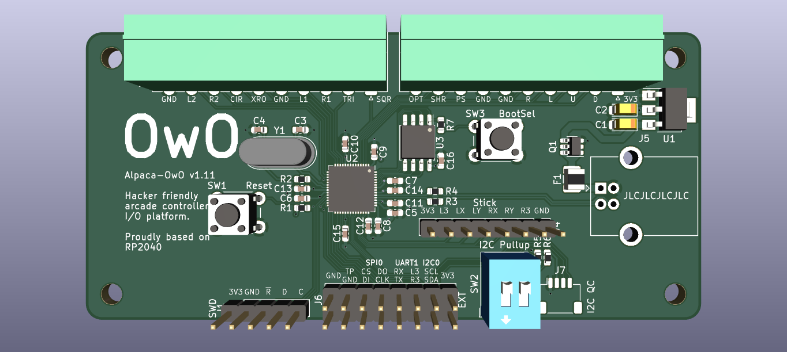

# GP2040 Configuration for Alpaca-OwO

Free, open source and flexible arcade controller I/O platform in standard fightstick PCB form factor.  

You can find the GitHub [Here](https://github.com/Project-Alpaca/Alpaca-OwO).

[Pin assignment](https://github.com/Project-Alpaca/Alpaca-OwO#pin-assignments). By default it uses GP2040's convention on Share/Touchpad key mapping (i.e. `Share == Select (S1)` and `Touchpad == Capture (A2)`).

Currently only the basic button pins and OLED display output are predefined by default. Other I/Os can be assigned on-demand to spare pins on the EXT port. Extra circuitry may be required for interfacing certain hardware that uses logic level different than 3.3V (e.g. WS281x LEDs).
