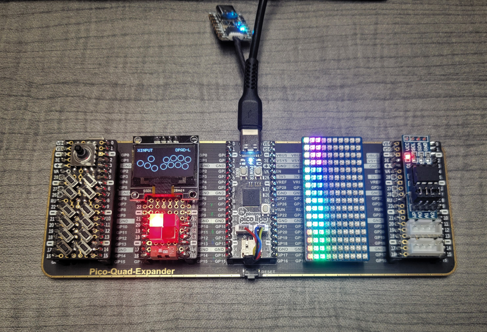

# GP2040 Configuration for Debugging

Feral's debugging setup. This is what peak performance looks like.

But seriously, it contains (from left to right):

- Custom "fightstick" Pico hat with 17 total inputs
  - 1x [10x10x9mm 5 Way Tact Switch](https://www.amazon.com/gp/product/B00E6QM2F0/)
  - 12x [3x6x4.3mm Tact Switch](https://www.amazon.com/gp/product/B008DS188Y/)
- Custom 128x32 SSD1306 I2C OLED
- [Pimoroni Pico LiPo](https://shop.pimoroni.com/products/pimoroni-pico-lipo) (USB-C FTW!)
- [Waveshare RGB 16x10 LED Matrix](https://www.waveshare.com/pico-rgb-led.htm)
- Custom player LED hat

All connected to a [Waveshare Quad GPIO Expander](https://www.waveshare.com/pico-quad-expander.htm). Custom hats are built on [Pimoroni Pico Proto boards](https://shop.pimoroni.com/products/pico-proto).

An [Adafruit QT Py RP2040](https://www.adafruit.com/product/4900) is attached to the Pico LiPo's JST-SH connectors for debugging.
