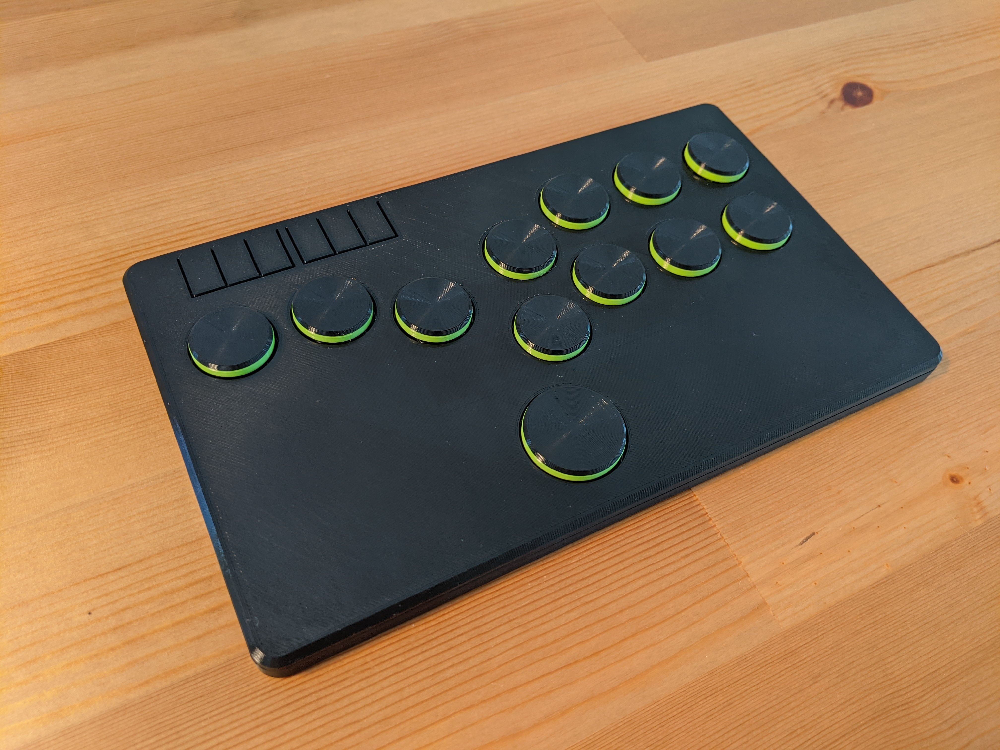

# GP2040 Configuration for Flatbox Rev 4

Configuration for the [Flatbox Rev 4](https://github.com/jfedor2/flatbox/tree/master/hardware-rev4), one of the excellent revisions of the [Flatbox](https://github.com/jfedor2/flatbox) design by [jfedor2](https://github.com/jfedor2) powered by an RP2040 MCU.

