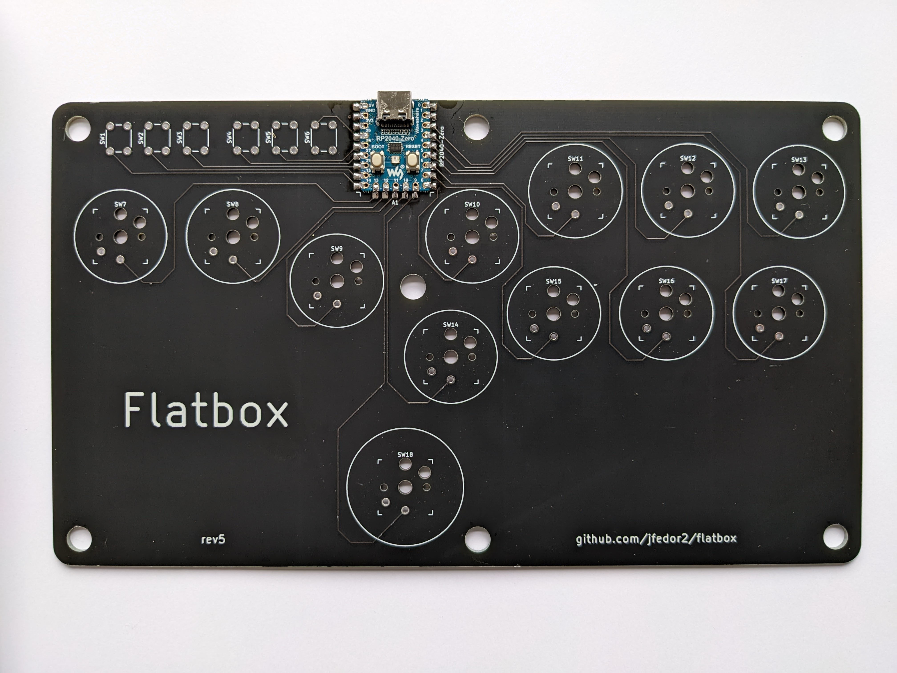

# GP2040 Configuration for Flatbox rev5

Configuration for the [Flatbox rev5](https://github.com/jfedor2/flatbox/tree/master/hardware-rev5), a variant of the [Flatbox](https://github.com/jfedor2/flatbox) design by [jfedor2](https://github.com/jfedor2). This revision uses an RP2040-Zero board.

## Main Pin Mapping Configuration

| RP2040 Pin  | Action                          | Flatbox Rev5 SW# | GP2040 | Xinput | Switch  | PS3/4/5  | Dinput | Arcade |
| ----------- | ------------------------------- | ---------------- | ------ | ------ | ------- | -------- | ------ | ------ |
| GPIO_PIN_14 | GpioAction::BUTTON_PRESS_S2     | S1               | S2     | Start  | Plus    | Start    | 10     | Start  |
| GPIO_PIN_15 | GpioAction::BUTTON_PRESS_S1     | S2               | S1     | Back   | Minus   | Select   | 9      | Coin   |
| GPIO_PIN_26 | GpioAction::BUTTON_PRESS_A1     | S3               | A1     | Guide  | Home    | PS       | 13     | ~      |
| GPIO_PIN_27 | GpioAction::BUTTON_PRESS_A2     | S4               | A2     | ~      | Capture | ~        | 14     | ~      |
| GPIO_PIN_28 | GpioAction::BUTTON_PRESS_L3     | S5               | L3     | LS     | LS      | L3       | 11     | LS     |
| GPIO_PIN_29 | GpioAction::BUTTON_PRESS_R3     | S6               | R3     | RS     | RS      | R3       | 12     | RS     |
| GPIO_PIN_13 | GpioAction::BUTTON_PRESS_LEFT   | S7               | LEFT   | LEFT   | LEFT    | LEFT     | LEFT   | LEFT   |
| GPIO_PIN_12 | GpioAction::BUTTON_PRESS_DOWN   | S8               | DOWN   | DOWN   | DOWN    | DOWN     | DOWN   | DOWN   |
| GPIO_PIN_11 | GpioAction::BUTTON_PRESS_RIGHT  | S9               | RIGHT  | RIGHT  | RIGHT   | RIGHT    | RIGHT  | RIGHT  |
| GPIO_PIN_08 | GpioAction::BUTTON_PRESS_B3     | S10              | B3     | X      | Y       | Square   | 1      | P1     |
| GPIO_PIN_06 | GpioAction::BUTTON_PRESS_B4     | S11              | B4     | Y      | X       | Triangle | 4      | P2     |
| GPIO_PIN_04 | GpioAction::BUTTON_PRESS_R1     | S12              | R1     | RB     | R       | R1       | 6      | P3     |
| GPIO_PIN_02 | GpioAction::BUTTON_PRESS_L1     | S13              | L1     | LB     | L       | L1       | 5      | P4     |
| GPIO_PIN_09 | GpioAction::BUTTON_PRESS_B1     | S14              | B1     | A      | B       | Cross    | 2      | K1     |
| GPIO_PIN_07 | GpioAction::BUTTON_PRESS_B2     | S15              | B2     | B      | A       | Circle   | 3      | K2     |
| GPIO_PIN_05 | GpioAction::BUTTON_PRESS_R2     | S16              | R2     | RT     | ZR      | R2       | 8      | K3     |
| GPIO_PIN_03 | GpioAction::BUTTON_PRESS_L2     | S17              | L2     | LT     | ZL      | L2       | 7      | K4     |
| GPIO_PIN_10 | GpioAction::BUTTON_PRESS_UP     | S18              | UP     | UP     | UP      | UP       | UP     | UP     |

