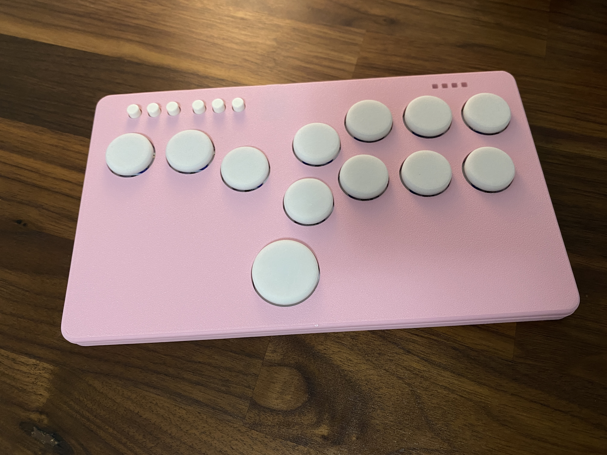

# GP2040 Configuration for Flatbox rev5 RGB

Configuration for the [Flatbox rev5 RGB](https://github.com/OpenStickCommunity/Hardware/tree/main/Flatbox%20Rev%205%20RGB), a variant of the [Flatbox](https://github.com/jfedor2/flatbox) design by [jfedor2](https://github.com/jfedor2). This revision uses an RP2040-Zero board and introduces RGB LEDs for buttons and players.
