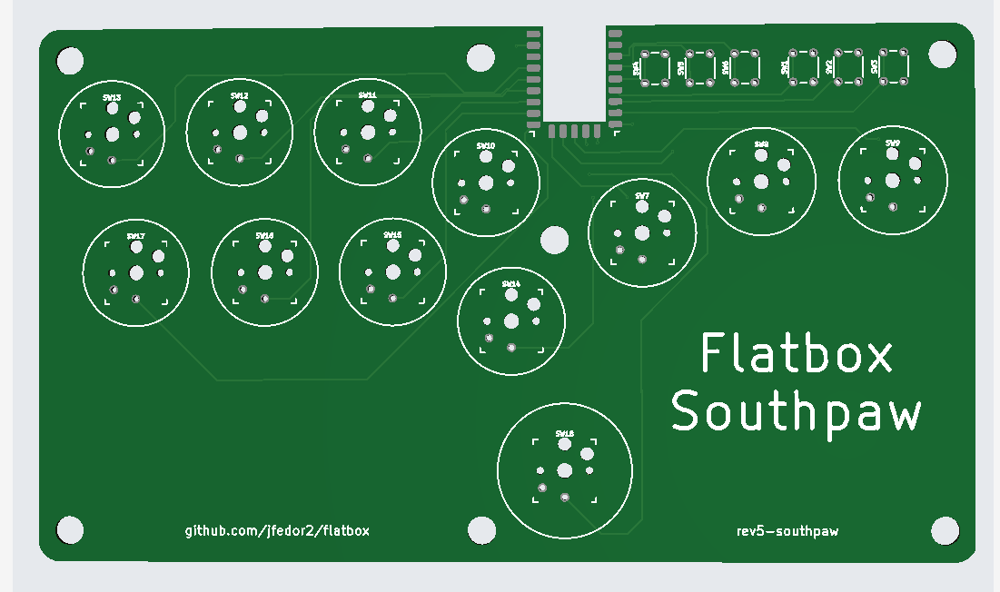

# GP2040 Configuration for Flatbox rev5 southpaw

Configuration for the [Flatbox rev5-southpaw](https://github.com/SkylaHila/flatbox-southpaw), a variant of the [Flatbox](https://github.com/jfedor2/flatbox) design by [jfedor2](https://github.com/jfedor2). This revision uses an RP2040-Zero board.
