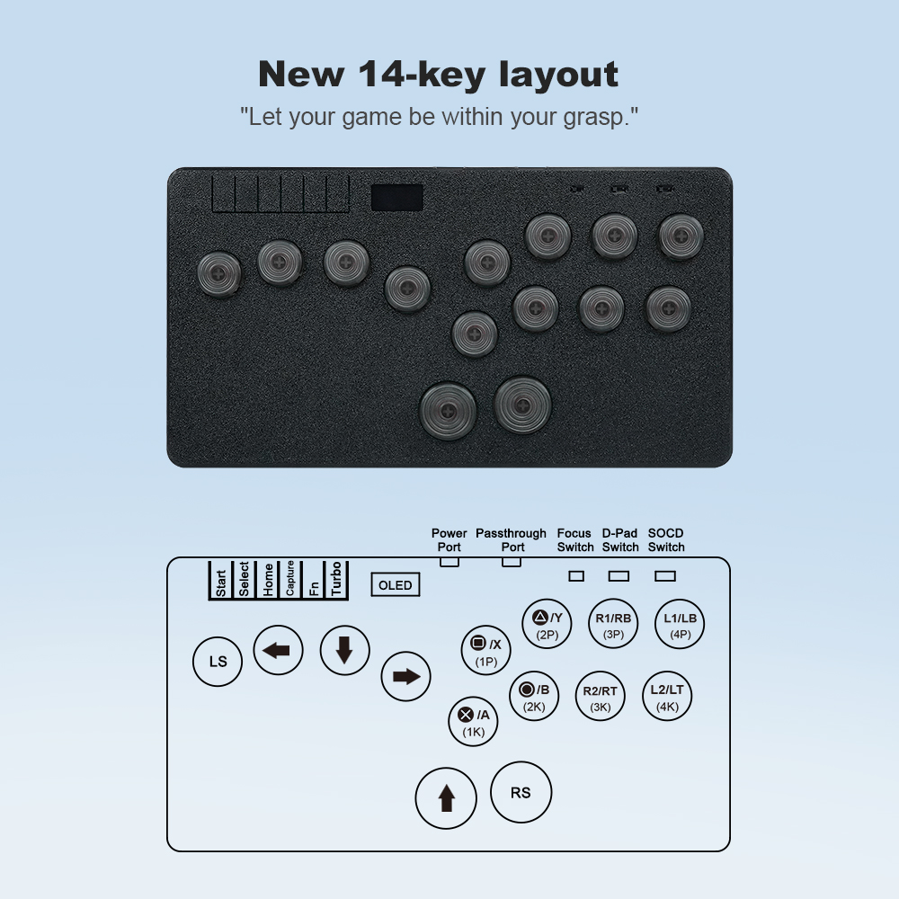

# GPR2040-CE Configuration for Flatbox Ultra

| Hardware/Features |  Flatbox-Ultra|
| ----| ----|
|flatbox layout | 14keys |
|OLED display | yes |
|Focus on mode (on/off) | yes, slider toggle|
|D-PAD/left stick/right stick/ mode | configured via slider |
|SOCD mode (up priority/neutral/last win)| yes, configured via slider|
|USB Passthrough | yes |

## Default configuration

Default configuration with key mapping for supported input modes

| Macro               | HID Key               | GP2040         | Xinput   | Switch   | PS3/4/5    | Dinput | Arcade |
|---------------------|-----------------------|----------------|----------|----------|------------|--------|--------|
| `KEY_DPAD_UP`       | `HID_KEY_ARROW_UP`    | UP             | UP       | UP       | UP         | UP     | UP     |
| `KEY_DPAD_DOWN`     | `HID_KEY_ARROW_DOWN`  | DOWN           | DOWN     | DOWN     | DOWN       | DOWN   | DOWN   |
| `KEY_DPAD_RIGHT`    | `HID_KEY_ARROW_RIGHT` | RIGHT          | RIGHT    | RIGHT    | RIGHT      | RIGHT  | RIGHT  |
| `KEY_DPAD_LEFT`     | `HID_KEY_ARROW_LEFT`  | LEFT           | LEFT     | LEFT     | LEFT       | LEFT   | LEFT   |
| `KEY_BUTTON_B1`     | `HID_KEY_SHIFT_LEFT`  | B1             | A        | B        | Cross      | 2      | K1     |
| `KEY_BUTTON_B2`     | `HID_KEY_Z`           | B2             | B        | A        | Circle     | 3      | K2     |
| `KEY_BUTTON_R2`     | `HID_KEY_X`           | R2             | RT       | ZR       | R2         | 8      | K3     |
| `KEY_BUTTON_L2`     | `HID_KEY_V`           | L2             | LT       | ZL       | L2         | 7      | K4     |
| `KEY_BUTTON_B3`     | `HID_KEY_CONTROL_LEFT`| B3             | X        | Y        | Square     | 1      | P1     |
| `KEY_BUTTON_B4`     | `HID_KEY_ALT_LEFT`    | B4             | Y        | X        | Triangle   | 4      | P2     |
| `KEY_BUTTON_R1`     | `HID_KEY_SPACE`       | R1             | RB       | R        | R1         | 6      | P3     |
| `KEY_BUTTON_L1`     | `HID_KEY_C`           | L1             | LB       | L        | L1         | 5      | P4     |
| `KEY_BUTTON_S1`     | `HID_KEY_5`           | S1             | Back     | Minus    | Select     | 9      | Coin   |
| `KEY_BUTTON_S2`     | `HID_KEY_1`           | S2             | Start    | Plus     | Start      | 10     | Start  |
| `KEY_BUTTON_L3`     | `HID_KEY_EQUAL`       | L3             | LS       | LS       | L3         | 11     | LS     |
| `KEY_BUTTON_R3`     | `HID_KEY_MINUS`       | R3             | RS       | RS       | R3         | 12     | RS     |
| `KEY_BUTTON_A1`     | `HID_KEY_9`           | A1             | Guide    | Home     | PS         | 13     | ~      |
| `KEY_BUTTON_A2`     | `HID_KEY_F2`          | A2             | ~        | Capture  | ~          | 14     | ~      |
| `KEY_BUTTON_FN`     | `-1`                  | Hotkey Function|          |          |            |        |        |

