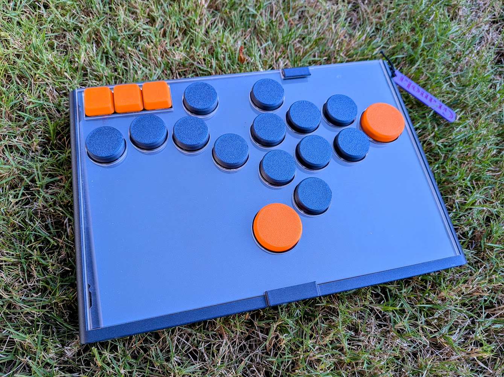

# GP2040 Configuration for Granola Beacon

Configuration for the Beacon hall effect controller by [Granola Arcade](https://granola.games).

The Beacon features 18 DRV5053 hall effect analog sensors supported by three 74HC4051 multiplexers.

Four additional digital buttons are accessible via TRS ports along the top of the controller for external buttons like foot pedals.