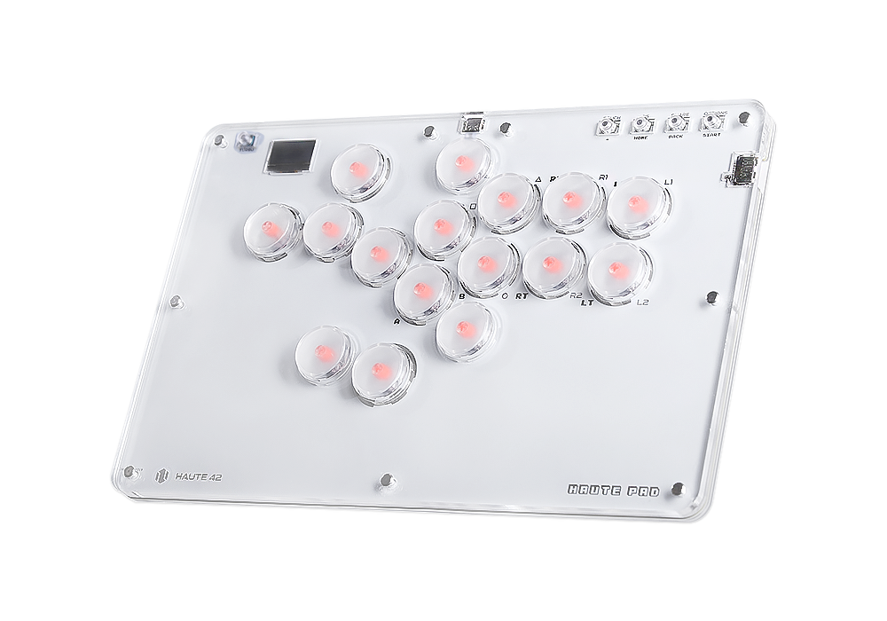
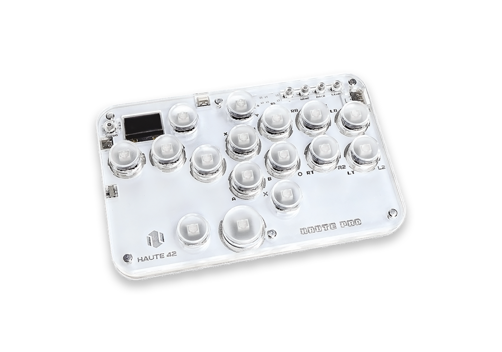

# GP2040 Configuration for the Haute42 COSMOX series of devices

Configuration for the [Haute42](https://haute42.com/) series of devices.  

Haute42 T Series including the T13 and T16 - Check it out [here](https://haute42.com/haute-pad-t-series/)

Haute42 G Series including the G12, G13 and G16 - Check it out [here](https://haute42.com/haute-pad-g-series/)

Haute42 Mini Sieres inclusing the Mini and DIY Mini ket - Check it out [here](https://haute42.com/haute-board-mini/)

