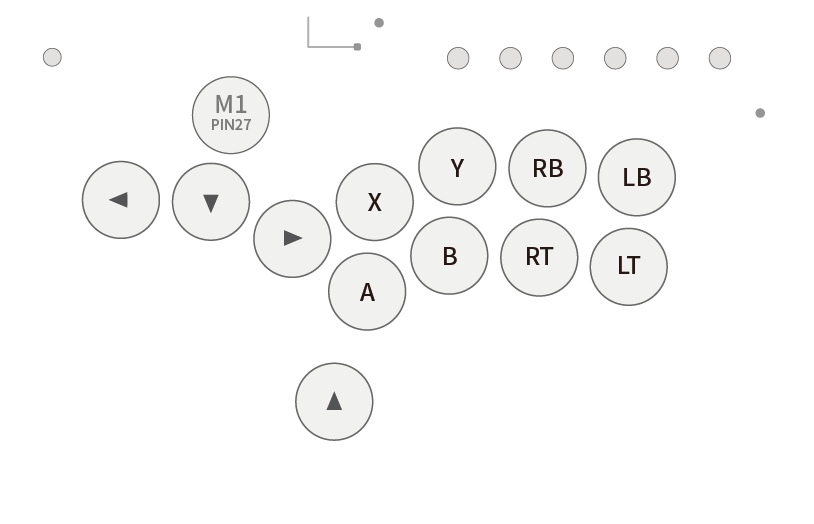
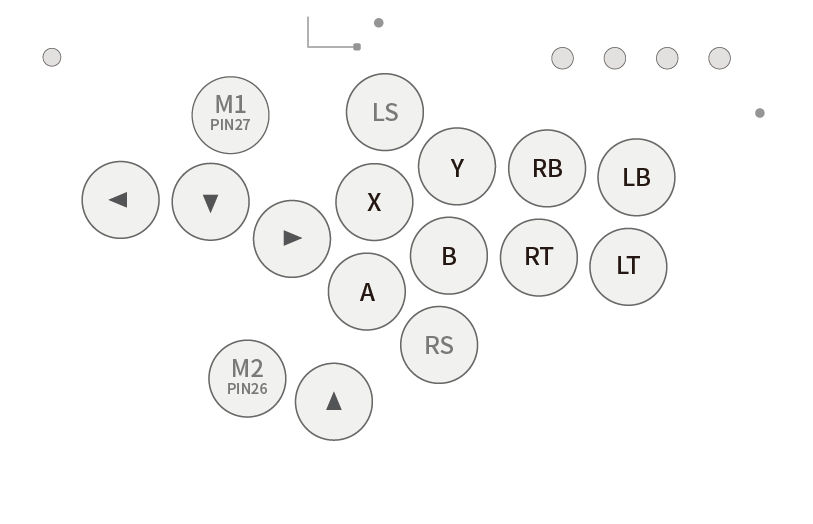
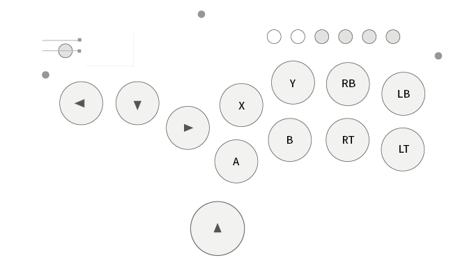
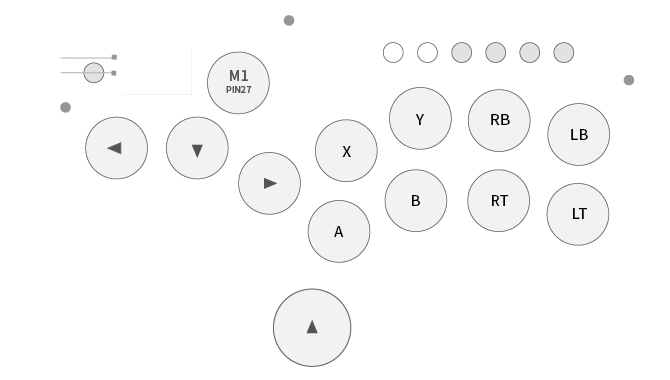
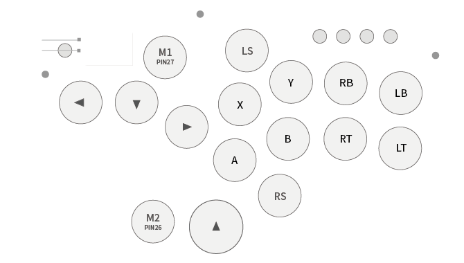
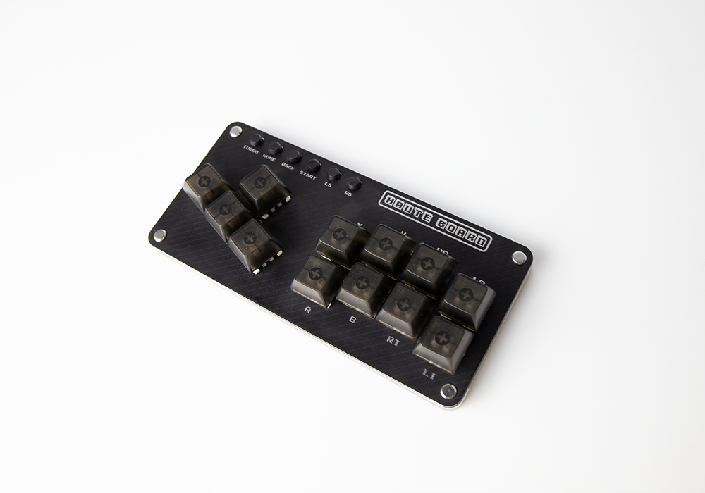
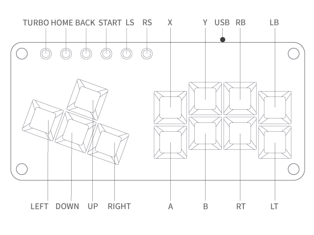

# GP2040 Configuration for the Haute42 COSMOX series of devices

Configuration for the [Haute42](https://haute42.com/) series of devices.

Haute42 T Series including the T13 and T16 - Check it out [here](https://haute42.com/haute-pad-t-series/)

Haute42 G Series including the G12, G13 and G16 - Check it out [here](https://haute42.com/haute-pad-g-series/)

Haute42 Mini Sieres inclusing the Mini and DIY Mini ket - Check it out [here](https://haute42.com/haute-board-mini/)

## Main Pin Mapping Configuration

| RP2040 Pin | Action                        | GP2040 | Xinput | Switch | PS3/4/5  | Dinput | Arcade |
|------------|-------------------------------|--------|--------|--------|----------|--------|--------|
| GPIO_PIN_02| GpioAction::BUTTON_PRESS_UP   | UP     | UP     | UP      | UP      | UP     | UP     |
| GPIO_PIN_03| GpioAction::BUTTON_PRESS_DOWN | DOWN   | DOWN   | DOWN    | DOWN    | DOWN   | DOWN   |
| GPIO_PIN_04| GpioAction::BUTTON_PRESS_RIGHT| RIGHT  | RIGHT  | RIGHT   | RIGHT   | RIGHT  | RIGHT  |
| GPIO_PIN_05| GpioAction::BUTTON_PRESS_LEFT | LEFT   | LEFT   | LEFT    | LEFT    | LEFT   | LEFT   |
| GPIO_PIN_06| GpioAction::BUTTON_PRESS_B1   | B1     | A      | B       | Cross   | 2      | K1     |
| GPIO_PIN_07| GpioAction::BUTTON_PRESS_B2   | B2     | B      | A       | Circle  | 3      | K2     |
| GPIO_PIN_08| GpioAction::BUTTON_PRESS_R2   | R2     | RT     | ZR      | R2      | 8      | K3     |
| GPIO_PIN_09| GpioAction::BUTTON_PRESS_L2   | L2     | LT     | ZL      | L2      | 7      | K4     |
| GPIO_PIN_10| GpioAction::BUTTON_PRESS_B3   | B3     | X      | Y       | Square  | 1      | P1     |
| GPIO_PIN_11| GpioAction::BUTTON_PRESS_B4   | B4     | Y      | X       | Triangle| 4      | P2     |
| GPIO_PIN_12| GpioAction::BUTTON_PRESS_R1   | R1     | RB     | R       | R1      | 6      | P3     |
| GPIO_PIN_13| GpioAction::BUTTON_PRESS_L1   | L1     | LB     | L       | L1      | 5      | P4     |
| GPIO_PIN_16| GpioAction::BUTTON_PRESS_S1   | S1     | Back   | Minus   | Select  | 9      | Coin   |
| GPIO_PIN_17| GpioAction::BUTTON_PRESS_S2   | S2     | Start  | Plus    | Start   | 10     | Start  |
| GPIO_PIN_18| GpioAction::BUTTON_PRESS_L3   | L3     | LS     | LS      | L3      | 11     | LS     |
| GPIO_PIN_19| GpioAction::BUTTON_PRESS_R3   | R3     | RS     | RS      | R3      | 12     | RS     |
| GPIO_PIN_20| GpioAction::BUTTON_PRESS_A1   | A1     | Guide  | Home    | PS      | 13     | ~      |
| GPIO_PIN_21| GpioAction::BUTTON_PRESS_A2   | A2     | ~      | Capture | ~       | 14     | ~      |