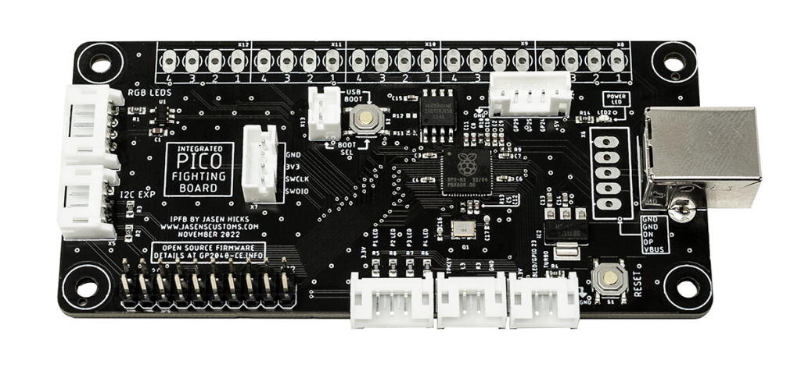

# GP2040-CE Configuration for JasensCustoms Integrated Pico Fighting Board

* GP2040-CE layout for the JasensCustoms [Integrated Pico Fighting Board(IPFB)](https://jasenscustoms.com/collections/fight-stick-pcbs/products/integrated-pico-fighting-board-gp2040ce)

Turbo on pin 28, with LED on 23. RGB LED Data set to pin 15.

Closed source board based on FeralAI's innovative Pico Fighting Board. Designed to have the same level of polish as any purchasable board, and to be intercompatible with existing Brook offerings.
 
