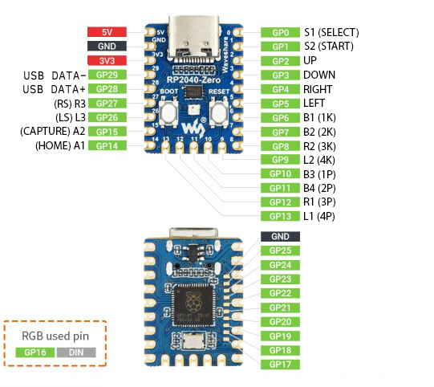

# GP2040 Configuration for the Keyboard Converter

Basic pin setup for the Waveshare RP2040 Zero based Keyboard Converter.

The embedded version of the Keyboard converter uses the same pinout for the RP2040 as the Waveshare 
RP2040 Zero