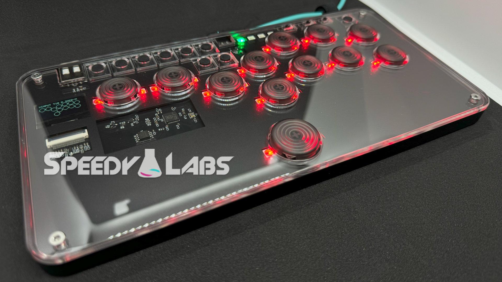
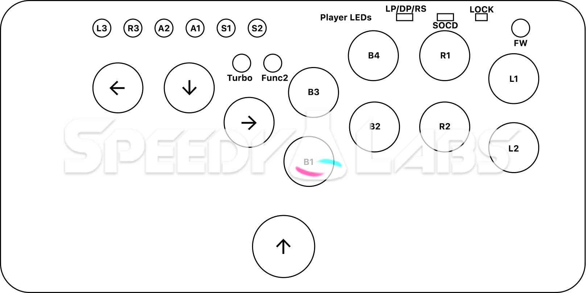
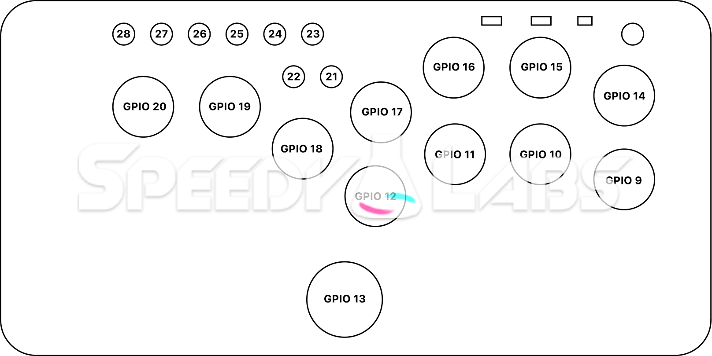

# GP2040 Configuration for the Speedy Labs LightFox

Configuration for the [Speedy Labs](https://www.speedylabs.us/) LightFox.  Available [here](https://www.speedylabs.us/product/lightfox-light-fighting-box/).

Button Map

GPIO Map

YouTube Video Showcase Below (Click):

