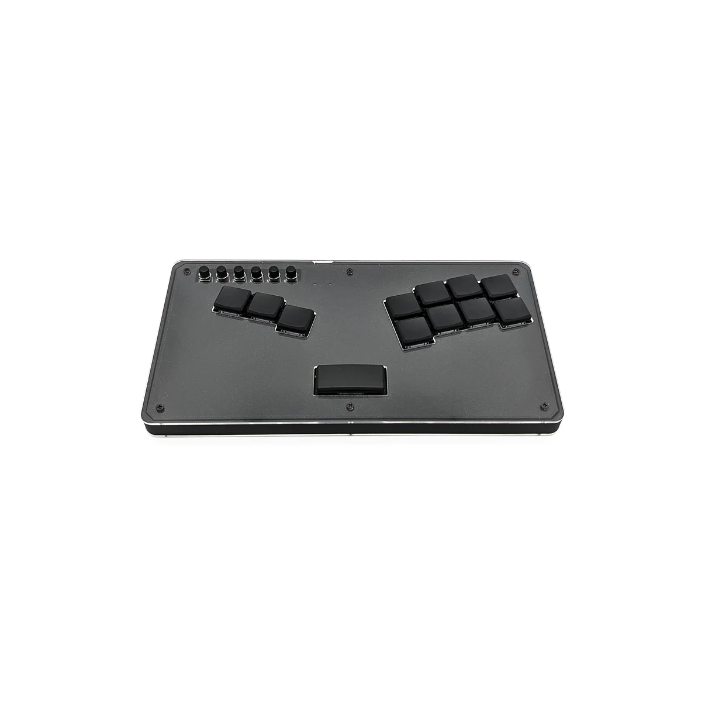
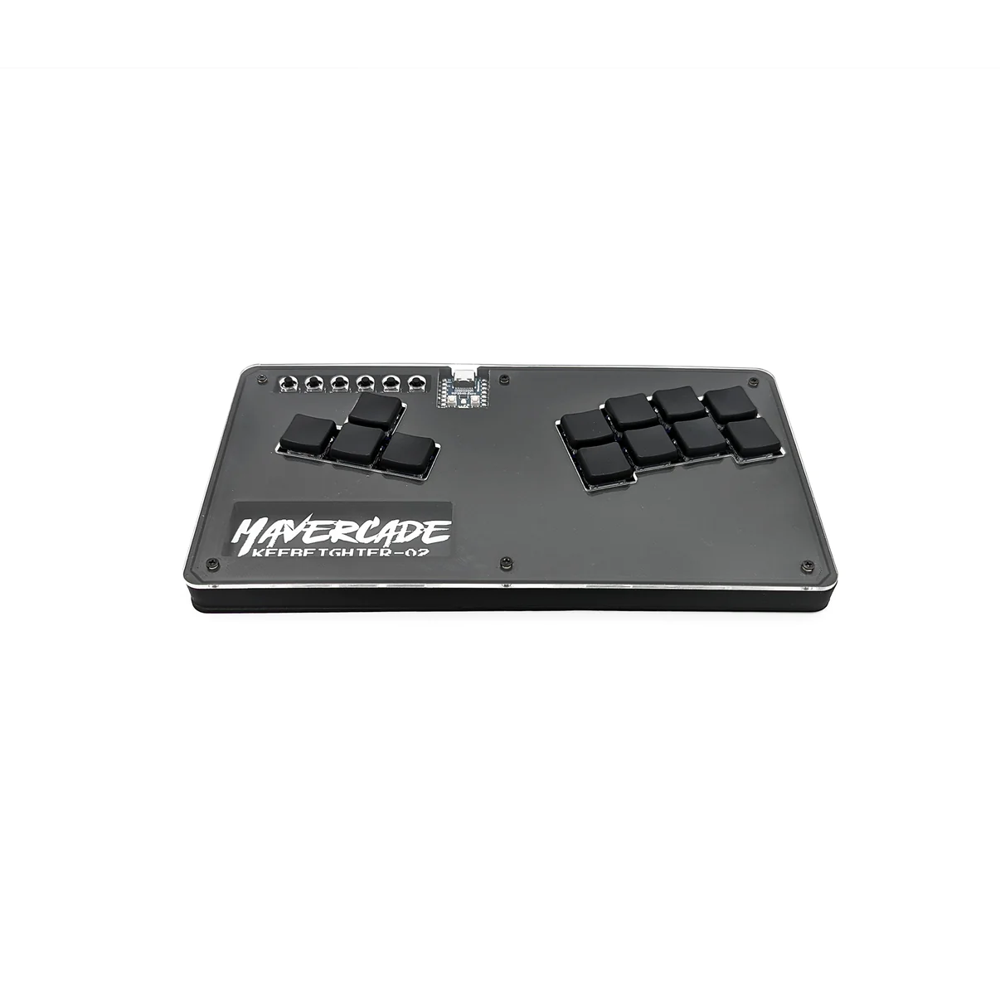

# GP2040 Configuration for the Mavercade Keebfighter

Configuration for the [Mavercade Keebfighters](https://mavercade.com/collections/mavercade-fightsticks).  The Mavercade Keebfighters are based on the [Flatbox rev5](https://github.com/jfedor2/flatbox/tree/master/hardware-rev5), a variant of the [Flatbox](https://github.com/jfedor2/flatbox) design by [jfedor2](https://github.com/jfedor2). These revisions use a Waveshare RP2040-Zero board.

Mavercade Keebfighter 00 - Check it out [here](https://mavercade.com/products/mavercade-keebfighter-00)

Mavercade Keebfighter 01 - Check it out [here](https://mavercade.com/products/mavercade-keebfighter-01)

Mavercade Keebfighter 02 - Check it out [here](https://mavercade.com/products/mavercade-keebfighter-02)
