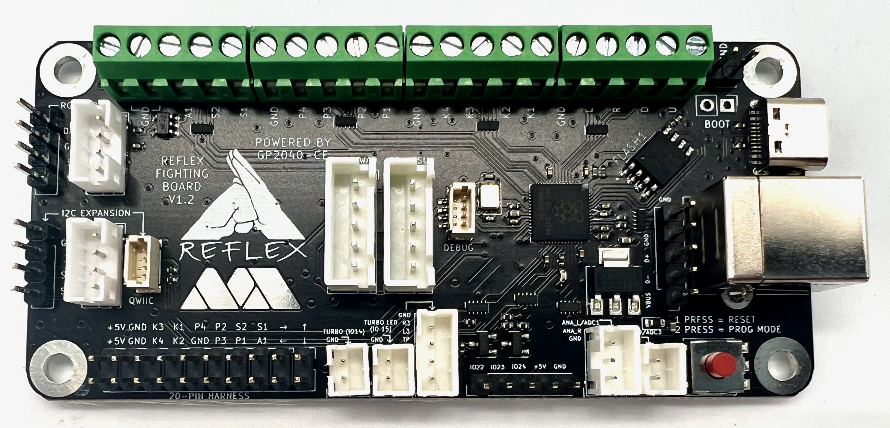

# GP2040-CE Configuration for the MiSTercade V2 Board by MiSTer Addons

MiSTercade is a fully featured JAMMA adapter board for the MiSTer FPGA project. 

GitHub: https://github.com/misteraddons/MiSTercade-Config
Purchase from: https://misteraddons.com/products/mistercade?_pos=14&_sid=42fab96c1&_ss=r&variant=39809030357125

MiSTerAddons: https://misteraddons.com/

