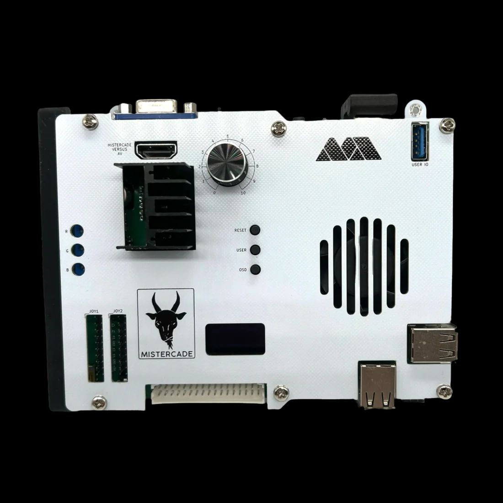

# GP2040-CE Configuration for the MiSTercade V2 board by MiSTer Addons

The second version of the fan favorite MiSTercade, now using GP2040-CE as the base for the input firmware.

MiSTercade is a JAMMA compliant hat for the MiSTer FPGA project. 

Features

* Lightning fast controls (0.8ms)
* Reference quality HDMI DAC for pristine analog video
* Supports MiSTercade Remote and MiSTercade Versus accessories

Purchase: https://misteraddons.com/products/mistercade-v2-kit-mister-fpga-jamma-arcade-kit

GitHub: https://github.com/misteraddons/MiSTercade-Config
