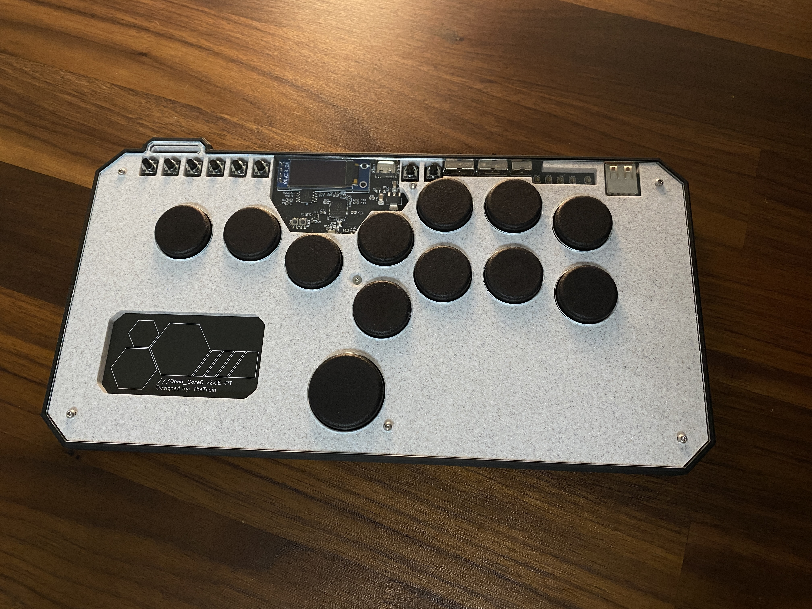
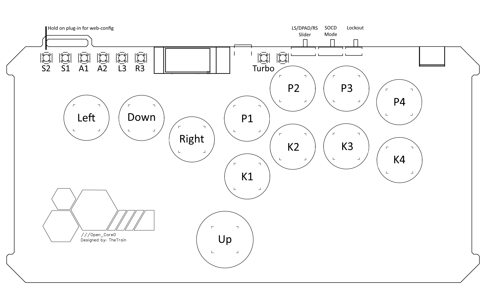

# GP2040 Configuration for the Open_Core0

Basic pin setup for the Open_Core0.

You can find the full Open_Core0 project over on our hardware section [HERE](https://github.com/OpenStickCommunity/Hardware/tree/main/Open_Core0)