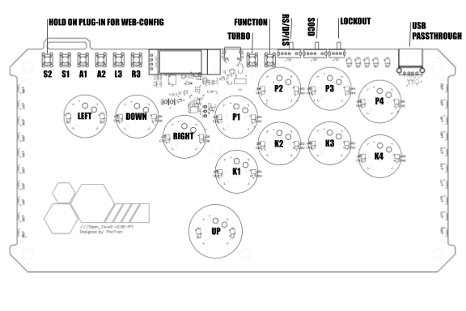
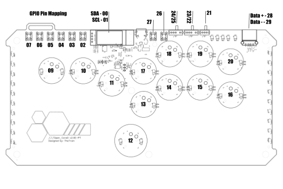
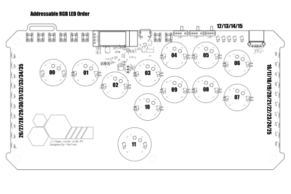

# GP2040 Configuration for the Open_Core0

Layout for the Open_Core0

GPIO mapping for the Open_Core0

Addressible RGB LED order for the Open_Core0

You can find the full Open_Core0 project over on our hardware section [HERE](https://github.com/OpenStickCommunity/Hardware/tree/main/Open_Core0)