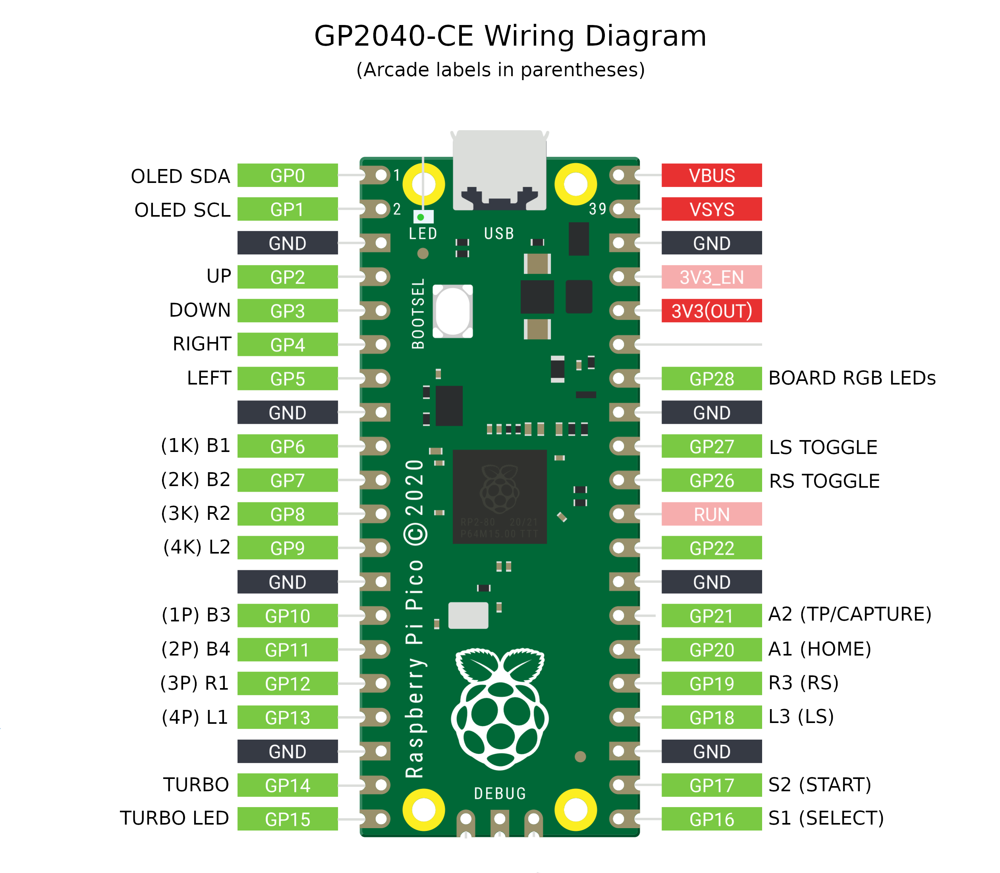

# GP2040 Configuration for Raspberry Pi Pico



Basic pin setup for a stock Raspberry Pi Pico. Combine with a simple GPIO breakout/screw terminal board for an easy DIY arcade stick.

## Main Pin Mapping Configuration

| RP2040 Pin | Action                        | GP2040 | Xinput | Switch | PS3/4/5  | Dinput | Arcade |
|------------|-------------------------------|--------|--------|--------|----------|--------|--------|
| GPIO_PIN_02| GpioAction::BUTTON_PRESS_UP   | UP     | UP     | UP     | UP       | UP     | UP     |
| GPIO_PIN_03| GpioAction::BUTTON_PRESS_DOWN | DOWN   | DOWN   | DOWN   | DOWN     | DOWN   | DOWN   |
| GPIO_PIN_04| GpioAction::BUTTON_PRESS_RIGHT| RIGHT  | RIGHT  | RIGHT  | RIGHT    | RIGHT  | RIGHT  |
| GPIO_PIN_05| GpioAction::BUTTON_PRESS_LEFT | LEFT   | LEFT   | LEFT   | LEFT     | LEFT   | LEFT   |
| GPIO_PIN_06| GpioAction::BUTTON_PRESS_B1   | B1     | A      | B      | Cross    | 2      | K1     |
| GPIO_PIN_07| GpioAction::BUTTON_PRESS_B2   | B2     | B      | A      | Circle   | 3      | K2     |
| GPIO_PIN_08| GpioAction::BUTTON_PRESS_R2   | R2     | RT     | ZR     | R2       | 8      | K3     |
| GPIO_PIN_09| GpioAction::BUTTON_PRESS_L2   | L2     | LT     | ZL     | L2       | 7      | K4     |
| GPIO_PIN_10| GpioAction::BUTTON_PRESS_B3   | B3     | X      | Y      | Square   | 1      | P1     |
| GPIO_PIN_11| GpioAction::BUTTON_PRESS_B4   | B4     | Y      | X      | Triangle | 4      | P2     |
| GPIO_PIN_12| GpioAction::BUTTON_PRESS_R1   | R1     | RB     | R      | R1       | 6      | P3     |
| GPIO_PIN_13| GpioAction::BUTTON_PRESS_L1   | L1     | LB     | L      | L1       | 5      | P4     |
| GPIO_PIN_16| GpioAction::BUTTON_PRESS_S1   | S1     | Back   | Minus  | Select   | 9      | Coin   |
| GPIO_PIN_17| GpioAction::BUTTON_PRESS_S2   | S2     | Start  | Plus   | Start    | 10     | Start  |
| GPIO_PIN_18| GpioAction::BUTTON_PRESS_L3   | L3     | LS     | LS     | L3       | 11     | LS     |
| GPIO_PIN_19| GpioAction::BUTTON_PRESS_R3   | R3     | RS     | RS     | R3       | 12     | RS     |
| GPIO_PIN_20| GpioAction::BUTTON_PRESS_A1   | A1     | Guide  | Home   | PS       | 13     | ~      |
| GPIO_PIN_21| GpioAction::BUTTON_PRESS_A2   | A2     | ~      | Capture| ~        | 14     | ~      |

## Hardware Turbo Controls (Optional)

This board supports optional hardware turbo controls via I2C GPIO expander:

### Pin Assignments
| RP2040 Pin | Function | Notes |
|------------|----------|-------|
| GPIO 0 | I2C SDA | Shared with display |
| GPIO 1 | I2C SCL | Shared with display |
| GPIO 26 | Speed Dial (ADC0) | Optional 10kΩ potentiometer |

### Required Hardware
- MCP23017 I2C GPIO Expander breakout board (I2C address 0x20)
- 8× SPST toggle switches (or DIP-8 switch array)
- 10kΩ linear potentiometer (optional, for adjustable turbo speed)

### Switch Mapping
The MCP23017's Port A pins map to the following buttons:
- GPA0 → B1 (Face button 1)
- GPA1 → B2 (Face button 2)
- GPA2 → B3 (Face button 3)
- GPA3 → B4 (Face button 4)
- GPA4 → L1 (Left shoulder 1)
- GPA5 → R1 (Right shoulder 1)
- GPA6 → L2 (Left shoulder 2)
- GPA7 → R2 (Right shoulder 2)

### Configuration
Enable in `BoardConfig.h`:
```cpp
#define TURBO_I2C_SWITCHES_ENABLED 1
#define TURBO_I2C_ADDR 0x20           // MCP23017 I2C address
#define PIN_SHMUP_DIAL 26             // Optional speed dial
```

See external documentation for complete wiring guide and troubleshooting.