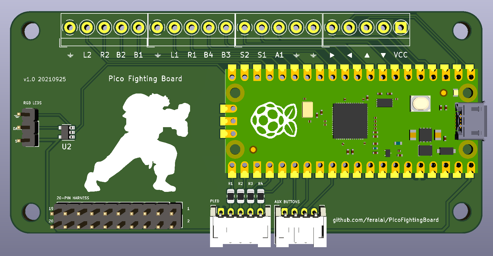

# GP2040 Configuration for Pico Fighting Board

Open source board based on the Brook board design: <https://github.com/FeralAI/PicoFightingBoard>. The board labels are associated with the GP2040 generic labeling. The 20-pin connector, 4-pin connector and screw terminals are button-compatible with the Brook wiring harnesses and button mappings.
