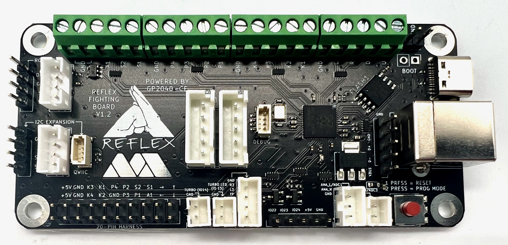

# GP2040-CE Configuration for the Reflex Board v1.2 by MiSTer Addons

Reflex Board v1.2
Open source PCB for arcade sticks using Raspberry Pi Pico's RP2040 microcontroller.

GitHub: https://github.com/misteraddons/ReflexFightingBoard/tree/main/boards/Reflex_Encode-V1.2-GP2040-CE
Purchase from: https://misteraddons.com/collections/parts/products/reflex-encode-fighting-board

MiSTer addons: https://misteraddons.com/

