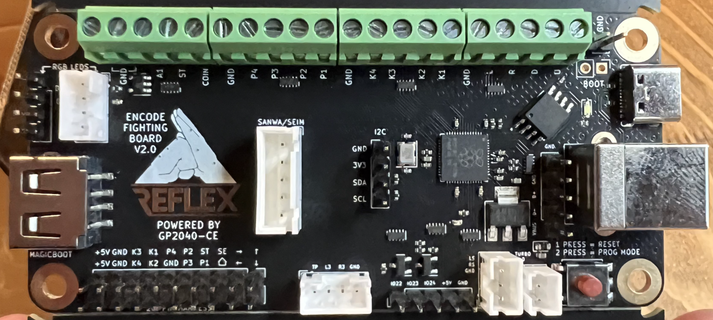

# GP2040-CE Configuration for the Reflex Board v2.0 by MiSTer Addons

Reflex Board v2.0
Open source PCB for arcade sticks using Raspberry Pi Pico's RP2040 microcontroller.

v2.0 adds USB passthrough authentication via GPIO14 (D+) and DPIO15 (D-).

GitHub: https://github.com/misteraddons/ReflexFightingBoard/tree/main/boards/Reflex_Encode-V2.0-GP2040-CE-USB_Pass_Auth
Purchase from: https://misteraddons.com/collections/parts/products/reflex-encode-fighting-board

MiSTer addons: https://misteraddons.com/