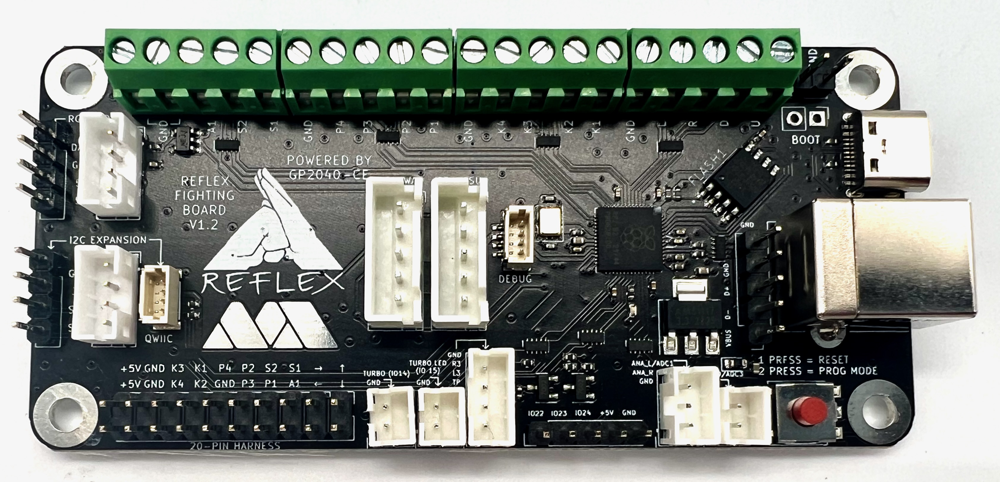

# GP2040-CE Configuration for the Reflex Board by MiSTer Addons

Reflex Board
Open source PCB for arcade sticks using Raspberry Pi Pico's RP2040 microcontroller.

GitHub: https://github.com/misteraddons/ReflexFightingBoard
Purchase from: https://misteraddons.com/collections/parts/products/reflex-encode-fighting-board

MiSTer addons: https://misteraddons.com/

