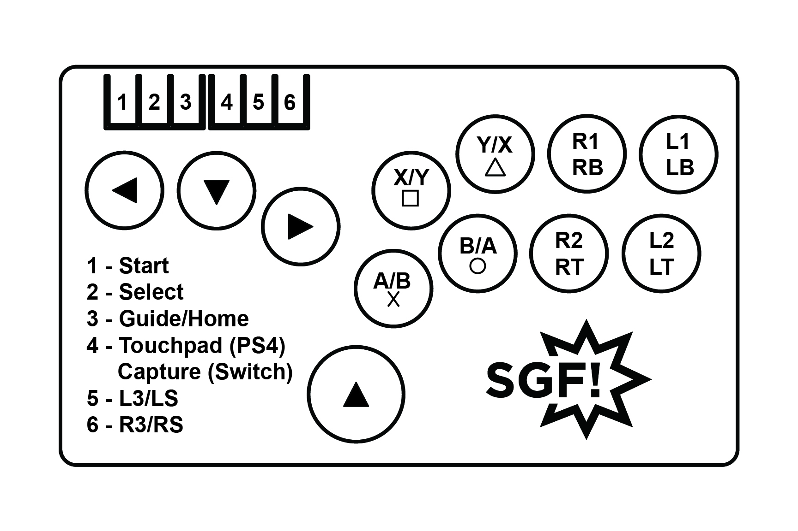

# GP2040 Configuration for SGF Flatboxes

Configuration for the SGF Flatbox-based controllers, based on the excellent revisions of the [Flatbox](https://github.com/jfedor2/flatbox) design by [jfedor2](https://github.com/jfedor2) powered by an RP2040 MCU. Available for purchase at [SGF](https://sgfdevices.com).

