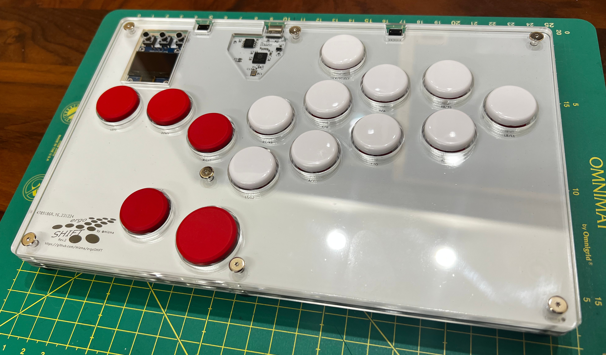
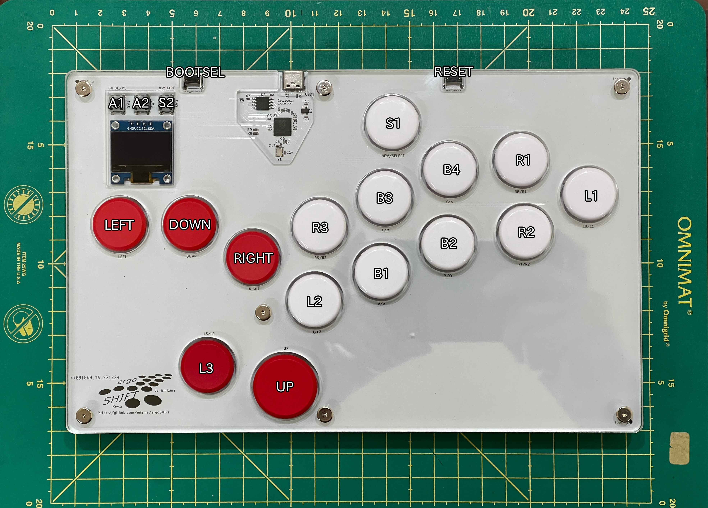

# GP2040 Configuration for the ergoSHIFT Rev.2

Configuration for the [ergoSHIFT Rev.2](https://github.com/mizma/ergoSHIFT/tree/main/hardware-rev2), a 4+11 button lever-less
arcade controller designed by [mizma](https://github.com/mizma/).

## Button mapping

