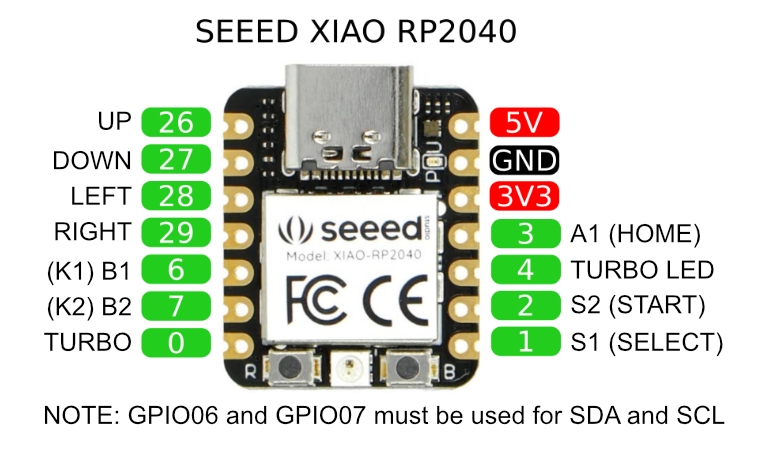

# GP2040 Configuration for the Seeed XIAO-RP2040

Basic pin setup for the Seeed XIAO-RP2040.

## Main Pin Mapping Configuration

// Main pin mapping Configuration
//                                                  // GP2040 | Xinput | Switch  | PS3/4/5  | Dinput | Arcade |
#define GPIO_PIN_26 GpioAction::BUTTON_PRESS_UP     // UP     | UP     | UP      | UP       | UP     | UP     |
#define GPIO_PIN_27 GpioAction::BUTTON_PRESS_DOWN   // DOWN   | DOWN   | DOWN    | DOWN     | DOWN   | DOWN   |
#define GPIO_PIN_29 GpioAction::BUTTON_PRESS_RIGHT  // RIGHT  | RIGHT  | RIGHT   | RIGHT    | RIGHT  | RIGHT  |
#define GPIO_PIN_28 GpioAction::BUTTON_PRESS_LEFT   // LEFT   | LEFT   | LEFT    | LEFT     | LEFT   | LEFT   |
#define GPIO_PIN_02 GpioAction::BUTTON_PRESS_S2     // S2     | Start  | Plus    | Start    | 10     | Start  |
#define GPIO_PIN_01 GpioAction::BUTTON_PRESS_S1     // S1     | Back   | Minus   | Select   | 9      | Coin   |
#define GPIO_PIN_06 GpioAction::BUTTON_PRESS_B1     // B1     | A      | B       | Cross    | 2      | K1     |
#define GPIO_PIN_07 GpioAction::BUTTON_PRESS_B2     // B2     | B      | A       | Circle   | 3      | K2     |
#define GPIO_PIN_03 GpioAction::BUTTON_PRESS_A1     // A1     | Guide  | Home    | PS       | 13     | ~      |

// Setting GPIO pins to assigned by add-on
//
#define GPIO_PIN_04 GpioAction::ASSIGNED_TO_ADDON

#define TURBO_ENABLED 1
#define GPIO_PIN_06 GpioAction::BUTTON_PRESS_TURBO
#define TURBO_LED_PIN 04