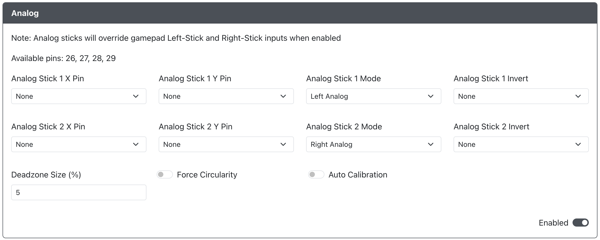

# Analog

* `Analog Stick 1 X Pin` - The GPIO pin used for the Analog Stick 1 X value.  Only ADC pins 26, 27, 28 and 29 are allowed here.
* `Analog Stick 1 Y Pin` - The GPIO pin used for the Analog Stick 1 Y value.  Only ADC pins 26, 27, 28 and 29 are allowed here.
* `Analog Stick 1 Mode` - Choose if Analog Stick 1 is to be used for Left Analog or Right Analog.
* `Analog Stick 1 Invert` - Choose if you would like to flip the X or Y axis Analog Stick 1 inputs (or both).
* `Analog Stick 2 X Pin` - The GPIO pin used for the Analog Stick 2 X value.  Only ADC pins 26, 27, 28 and 29 are allowed here.
* `Analog Stick 2 Y Pin` - The GPIO pin used for the Analog Stick 2 Y value.  Only ADC pins 26, 27, 28 and 29 are allowed here.
* `Analog Stick 2 Mode` - Choose if Analog Stick 2 is to be used for Left Analog or Right Analog (must be different than Analog Stick 1).
* `Analog Stick 2 Invert` - Choose if you would like to flip the X or Y axis Analog Stick 2 inputs (or both).
* `Deadzone Size (%)` - Enter the % value of deadzone you would like on the analog sticks.
* `Forced Circularity` - Force the analog sticks to be bound within a perfect circle. This can be beneficial for certain games. However, be aware that this may negatively impact some games which account for sticks moving outside of a circle.
* `Auto Calibration` - Automatically centers the analog sticks. This works by reading in the offset from center during boot and then accounts for that until the next power cycle. This can be helpful for analog sticks experiencing drift.
