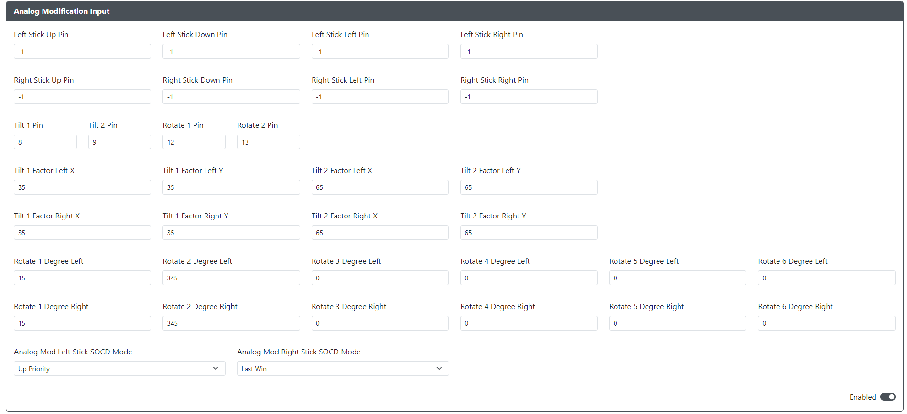

# Analog Modification Input

## Dedicated Analog Stick Pins
User can set dedicated analog stick pins to work with Tilt and Rotate features.
If no dedicated analog stick pins are set, Tilt and Rotate features will function when DPad is used as Left or Right Analog.
Otherwise, dedicated analog stick pins will have priority over DPad used as left or right analog sticks
* `Analog Modification Left Analog Up Pin` - The GPIO pin used for the Up direction on the Left analog stick.
* `Analog Modification Left Analog Down Pin` - The GPIO pin used for the Down direction on the Left analog stick.
* `Analog Modification Left Analog Left Pin` - The GPIO pin used for the Left direction on the Left analog stick.
* `Analog Modification Left Analog Right Pin` - The GPIO pin used for the Right direction on the Left analog stick.
* `Analog Modification Right Analog Up Pin` - The GPIO pin used for the Up direction on the Right analog stick.
* `Analog Modification Right Analog Down Pin` - The GPIO pin used for the Down direction on the Right analog stick.
* `Analog Modification Right Analog Left Pin` - The GPIO pin used for the Left direction on the Right analog stick.
* `Analog Modification Right Analog Right Pin` - The GPIO pin used for the Right direction on the Right analog stick.

## Tilt
Tilt 1 and Tilt 2 buttons, when pressed with directional buttons, adjust the analog values.
Pressing Tilt 1 or 2 with a value of N results in an input that is N% of the maximum direction. (Min. 0, Max. 100)
Pressing Tilt 1 and Tilt 2 simultaneously with LS or RS directional buttons will make them function as the D-Pad.

* `Tilt 1 Pin` - The GPIO pin used for the Tilt 1.
* `Tilt 2 Pin` - The GPIO pin used for the Tilt 2.
* `Tilt 1 Factor Left X` - The percentage of the X-axis input for the Left Stick when pressing Tilt 1.
* `Tilt 1 Factor Left Y` - The percentage of the Y-axis input for the Left Stick when pressing Tilt 1.
* `Tilt 2 Factor Left X` - The percentage of the X-axis input for the Left Stick when pressing Tilt 2.
* `Tilt 2 Factor Left Y` - The percentage of the Y-axis input for the Left Stick when pressing Tilt 2.
* `Tilt 1 Factor Right X` - The percentage of the X-axis input for the Right Stick when pressing Tilt 1.
* `Tilt 1 Factor Right Y` - The percentage of the Y-axis input for the Right Stick when pressing Tilt 1.
* `Tilt 2 Factor Right X` - The percentage of the X-axis input for the Right Stick when pressing Tilt 2.
* `Tilt 2 Factor Right Y` - The percentage of the Y-axis input for the Right Stick when pressing Tilt 2.

## Rotate
Rotate 1 and Rotate 2 buttons, when pressed with directional buttons, adjust the analog values.
All Rotate functions will make analog sticks rotate clockwise by the set degree. (Min. 0, Max. 360)
Pressing Rotate 1 and Rotate 2 simultaneously with LS or RS directional buttons will make them function as the D-Pad.
* `Rotate 1 Pin` - The GPIO pin used for the Rotate 1.
* `Rotate 2 Pin` - The GPIO pin used for the Rotate 2.
* `Rotate 1 Degree Left` - Clockwise rotate degree for Left Stick when pressing Rotate 1
* `Rotate 2 Degree Left` - Clockwise rotate degree for Left Stick when pressing Rotate 2
* `Rotate 3 Degree Left` - Clockwise rotate degree for Left Stick when pressing Rotate 1 + Tilt 1
* `Rotate 4 Degree Left` - Clockwise rotate degree for Left Stick when pressing Rotate 1 + Tilt 2
* `Rotate 5 Degree Left` - Clockwise rotate degree for Left Stick when pressing Rotate 2 + Tilt 1
* `Rotate 6 Degree Left` - Clockwise rotate degree for Left Stick when pressing Rotate 2 + Tilt 2
* `Rotate 1 Degree Right` - Clockwise rotate degree for Right Stick when pressing Rotate 1
* `Rotate 2 Degree Right` - Clockwise rotate degree for Right Stick when pressing Rotate 2
* `Rotate 3 Degree Right` - Clockwise rotate degree for Right Stick when pressing Rotate 1 + Tilt 1
* `Rotate 4 Degree Right` - Clockwise rotate degree for Right Stick when pressing Rotate 1 + Tilt 2
* `Rotate 5 Degree Right` - Clockwise rotate degree for Right Stick when pressing Rotate 2 + Tilt 1
* `Rotate 6 Degree Right` - Clockwise rotate degree for Right Stick when pressing Rotate 2 + Tilt 2

## SOCD
SOCD Cleaning Mode can be separately set for LS and RS. (Up Priority, Neutral, Last Win, First Win)
* `Analog Mod Left Stick SOCD Mode` - Choose the SOCD Cleaning Mode for Left Stick.
* `Analog Mod Right Stick SOCD Mode` - Choose the SOCD Cleaning Mode for Right Stick.

## Summary of Analog Mod Add-On
The table below provides the summary of all functions provided Analog Mod Add-On. 
`X` = button is pressed; `-` = button is not pressed
| Tilt1 | Tilt2 | Rotate1 | Rotate2 |   | LS Behavior | RS Behavior |
|:-----:|:-----:|:-------:|:-------:|:-:|:-----------:|:-----------:|
|   X   |   -   |    -    |    -    | ⇨ |    Tilt1    |    Tilt1    |
|   -   |   X   |    -    |    -    | ⇨ |    Tilt2    |    Tilt2    |
|   -   |   -   |    X    |    -    | ⇨ |   Rotate1   |   Rotate1   |
|   -   |   -   |    -    |    X    | ⇨ |   Rotate2   |   Rotate2   |
|   X   |   X   |    -    |    -    | ⇨ |    D-Pad    |    D-Pad    |
|   -   |   -   |    X    |    X    | ⇨ |    D-Pad    |    D-Pad    |
|   X   |   -   |    X    |    -    | ⇨ |   Rotate3   |   Rotate3   |
|   -   |   X   |    X    |    -    | ⇨ |   Rotate4   |   Rotate4   |
|   X   |   -   |    -    |    X    | ⇨ |   Rotate5   |   Rotate5   |
|   -   |   X   |    -    |    X    | ⇨ |   Rotate6   |   Rotate6   |
|   X   |   X   |    X    |    -    | ⇨ |      LS     |      RS     |
|   X   |   X   |    -    |    X    | ⇨ |      LS     |      RS     |
|   X   |   -   |    X    |    X    | ⇨ |      LS     |      RS     |
|   -   |   X   |    X    |    X    | ⇨ |      LS     |      RS     |
|   X   |   X   |    X    |    X    | ⇨ |      LS     |      RS     |
|   -   |   -   |    -    |    -    | ⇨ |      LS     |      RS     |
