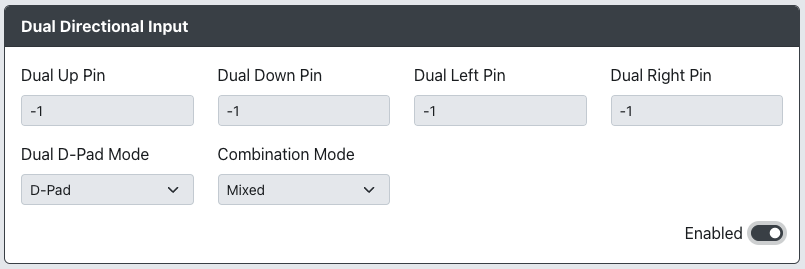

# Dual Directional Input

* `Dual Up Pin` - The GPIO pin used for the secondary Up direction.
* `Dual Down Pin` - The GPIO pin used for the secondary Down direction.
* `Dual Left Pin` - The GPIO pin used for the secondary Left direction.
* `Dual Right Pin` - The GPIO pin used for the secondary Right direction.
* `Dual D-Pad Mode` - Choose if this should act as an additional instance of the D-Pad or as the Left or Right stick.
Values are:
`D-PAD` for D-PAd mode.
`Left Analog` for Left Analog stick mode.
`Right Analog` for Right Analog stick mode.
* `Combination Mode` - Choose how these inputs should be combined.
Values are:
`Mixed` - Combines both the Gamepad input and Dual Directional and allows for all 3 SOCD modes.
`Gamepad` - Gamepad always takes over when pressed, otherwise Gamepad and Dual act independently.
`Dual Directional` - Dual always takes over when pressed, otherwise Gamepad and Dual act independently.
`None` - Gamepad input and dual directional act independently of each other.
