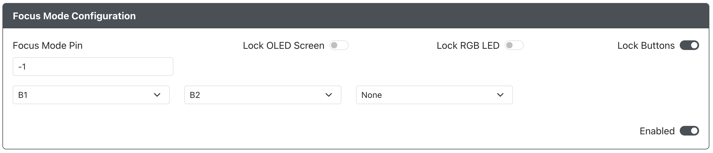

# Focus Mode Configuration

* `Focus Mode Pin` - The GPIO pin used to enable Focus Mode (this needs to always be held so a slider or latching switch is recommended).
* `Lock OLED Screen` - When enabled the OLED screen will not display anything during Focus Mode.
* `Lock RGB LED` - When enabled the RGB LEDs that are controlled by the RP2040 device will not display anything during Focus Mode.
* `Lock Buttons` - When enabled the You can specify specific buttons to not function during Focus Mode.  You can add as many additional buttons as needed here.