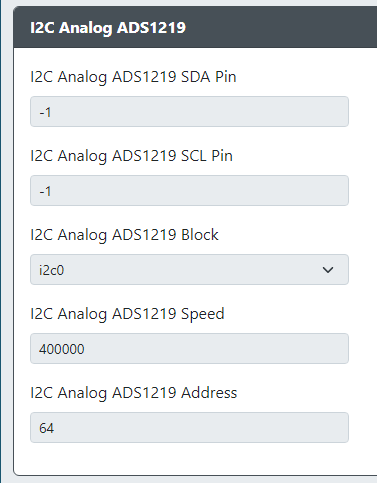

# I2C Analog ADS1219

* `I2C Analog ADS1219 SDA Pin` - The GPIO pin used for I2C Analog ADS1219 SDA.
* `I2C Analog ADS1219 SCL Pin` - The GPIO pin used for I2C Analog ADS1219 SCL.
* `I2C Analog ADS1219 Block` - The block of I2C to use (i2c0 or i2c1).
* `I2C Analog ADS1219 Speed` - Sets the speed of I2C communication. Common values are `100000` for standard, `400000` for fast and `800000` ludicrous speed.
* `I2C Analog ADS1219 Address` - Sets the address for the I2C Analog ADS1219.
