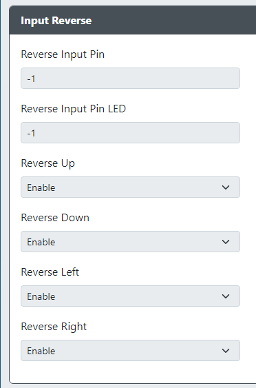

# Input Reverse

* `Reverse Input Pin` - The GPIO pin used for the Reverse Input button.
* `Reverse Input Pin LED` - The GPIO pin used for the Reverse Input LED.
* `Reverse Up` - Enables the up direction to be reversed when the Reverse Input button is pressed or held.
* `Reverse Down` - Enables the down direction to be reversed when the Reverse Input button is pressed or held.
* `Reverse Left` - Enables the left direction to be reversed when the Reverse Input button is pressed or held.
* `Reverse Right` - Enables the right direction to be reversed when the Reverse Input button is pressed or held.