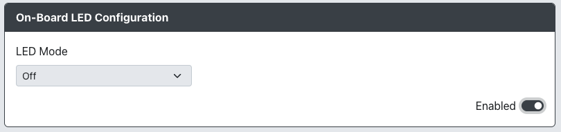

# On-board LED Configuration

* `Off` - LED is off
* `Mode Indicator` - LED is solid if unit is powered with connected data, LED blinks rapidly if powered with no data, LED blinks slowly when in web-config mode.
* `Input Test` - LED is off but turns on when any input is pressed (LED turns off when button is released).