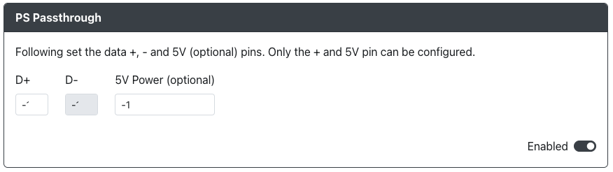

# PS Passthrough

Enabling this add-on will allow you to use a licensed 3rd party device to authenticate off of.  This add-on requires that you have something like the  or a board with a USB passthrough port on it already.  If you have passthrough enabled you can turn off the above `PS4 Mode` add-on as the two will not work together.  Please also ensure that under the `Settings` section you have chosen PS4 mode and picked if you want the GP2040-CE unit to function as a controller or as a fightstick.