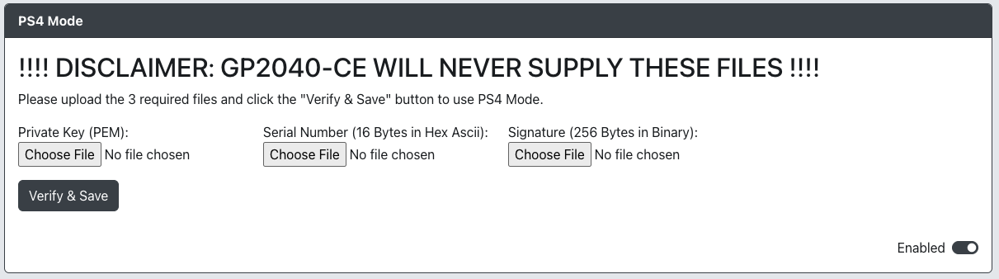

# PS4 Mode

Please note that GP2040-CE will never provide these files!

Enabling this add-on will allow you to use GP2040-CE on a PS4 with an 8 minute timeout.  If you have the necessary files to upload in this section it will authenticate to a native PS4 device and not time out after 8 minutes.

* `Private Key (PEM)` - Choose your PEM file.
* `Serial Number (16 Bytes in Hex Ascii)` - Choose your serial number file.
* `Signature (256 Bytes in Binary)` - Choose your signature file.