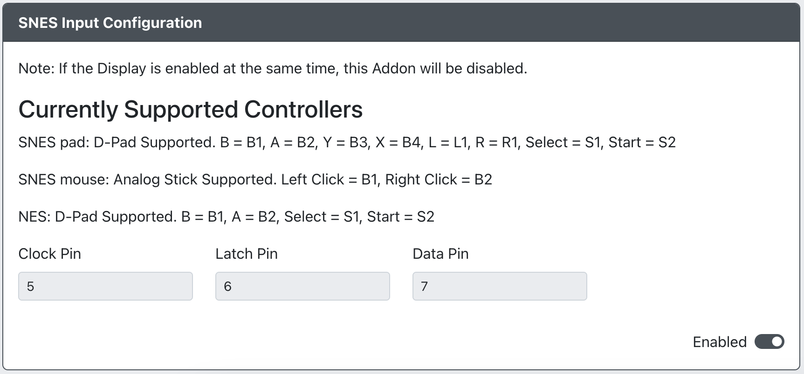

# SNES Input

* `CLOCK Pin` - The GPIO pin used for SNES CLOCK.
* `LATCH Pin` - The GPIO pin used for SNES LATCH.
* `DATA Pin` - The GPIO pin used for SNES DATA.

Supported controller types and their mapping is as follows:

| GP2040-CE | NES      | SNES         | Super NES Mouse    |
|-----------|----------|--------------|--------------------|
| B1        | B        | B            | Left Click         |
| B2        | A        | A            | Right Click        |
| B3        |          | Y            |                    |
| B4        |          | X            |                    |
| L1        |          | L            |                    |
| L2        |          |              |                    |
| R1        |          | R            |                    |
| R2        |          |              |                    |
| S1        | Select   | Select       |                    |
| S2        | Start    | Start        |                    |
| A1        |          |              |                    |
| D-Pad     | D-Pad    | D-Pad        |                    |
| Analog    |          |              | Mouse Movement     |