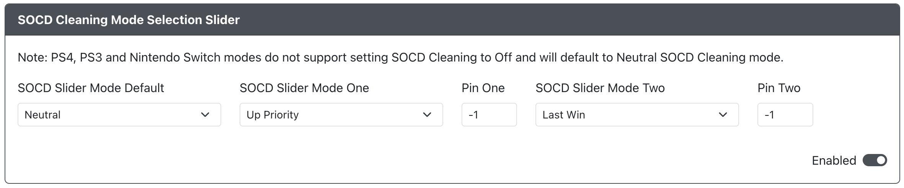

# SOCD Selection Slider

* `SOCD Slider Mode Default` - The default SOCD mode to be used when the slider pin is not activated.
* `SOCD Slider Mode One` - The SOCD mode you would like to have enabled for the first slider position.
* `Pin One` - The GPIO pin used for first SOCD mode slider position.
* `SOCD Slider Mode Two` - The SOCD mode you would like to have enabled for the second slider position.
* `Pin Two` - The GPIO pin used for second SOCD mode slider position.