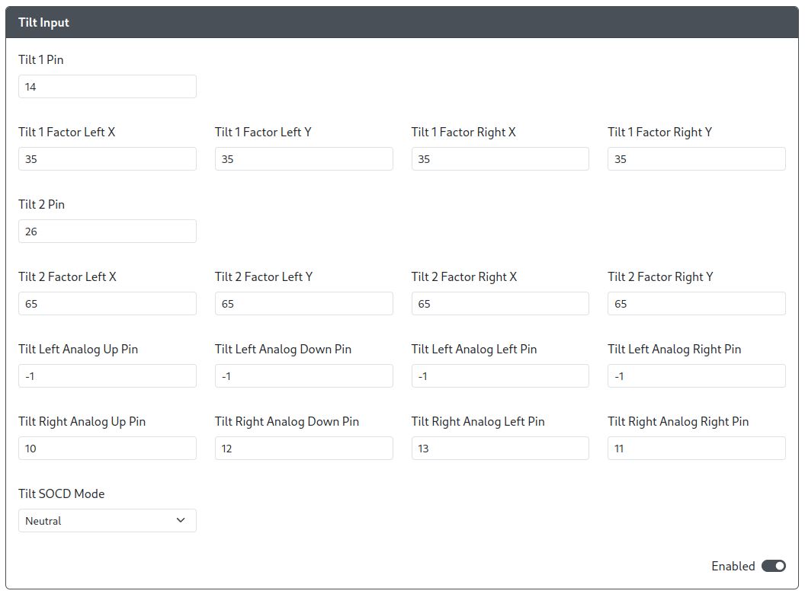

# Tilt Input

Purpose: The Tilt Input add-on allows users to send analog inputs from the Left and Right analog sticks that are some percent of the maximum directional input (e.g. send 65% of a Down-Right input on the Right analog stick).

* `Tilt 1 Pin` - The GPIO pin used for the Tilt 1 direction.
* `Tilt 1 Factor Left X` - The percentage of the X-axis input for the Left analog stick sent when `Tilt 1 Pin` is activated. (Min. 0, Max 100)
* `Tilt 1 Factor Left Y` - The percentage of the Y-axis input for the Left analog stick sent when `Tilt 1 Pin` is activated. (Min. 0, Max 100)
* `Tilt 1 Factor Left X` - The percentage of the X-axis input for the Right analog stick sent when `Tilt 1 Pin` is activated. (Min. 0, Max 100)
* `Tilt 1 Factor Left Y` - The percentage of the Y-axis input for the Right analog stick sent when `Tilt 1 Pin` is activated. (Min. 0, Max 100)
* `Tilt 2 Pin` - The GPIO pin used for the Tilt 2 direction.
* `Tilt 2 Factor Left X` - The percentage of the X-axis input for the Left analog stick sent when `Tilt 2 Pin` is activated. (Min. 0, Max 100)
* `Tilt 2 Factor Left Y` - The percentage of the Y-axis input for the Left analog stick sent when `Tilt 2 Pin` is activated. (Min. 0, Max 100)
* `Tilt 2 Factor Left X` - The percentage of the X-axis input for the Right analog stick sent when `Tilt 2 Pin` is activated. (Min. 0, Max 100)
* `Tilt 2 Factor Left Y` - The percentage of the Y-axis input for the Right analog stick sent when `Tilt 2 Pin` is activated. (Min. 0, Max 100)
* `Tilt Left Analog Up Pin` - The GPIO pin used for the Up direction on the Left analog stick.
* `Tilt Left Analog Down Pin` - The GPIO pin used for the Down direction on the Left analog stick.
* `Tilt Left Analog Left Pin` - The GPIO pin used for the Left direction on the Left analog stick.
* `Tilt Left Analog Right Pin` - The GPIO pin used for the Right direction on the Left analog stick.
* `Tilt Right Analog Up Pin` - The GPIO pin used for the Up direction on the Right analog stick.
* `Tilt Right Analog Down Pin` - The GPIO pin used for the Down direction on the Right analog stick.
* `Tilt Right Analog Left Pin` - The GPIO pin used for the Left direction on the Right analog stick.
* `Tilt Right Analog Right Pin` - The GPIO pin used for the Right direction on the Right analog stick.
* `Tilt SOCD Mode` - Choose the default SOCD Cleaning Mode (Neutral, Last Win, First Win). 

Hardware Requirements:

- Additional buttons, switches, or joysticks, are recommended for this add-on as this add-on entirely prevents the primary Dpad from being set as the Left analog or Right analog stick. 

Notes

- Because this add-on disables the Dpad from being set as Left analog and Right analog, using the hotkeys `Dpad Left Analog` and `Dpad Right Analog` deactivates the Dpad and using the `Dpad Digital` will reactivate the Dpad once more.
- Not all Tilt analog pins are required to be set, but not setting the pins will prevent you from using that input without using the Web Configurator to remap the inputs.
- Additionally, pressing Tilt 1 and Tilt 2 simultaneously while inputting Right analog stick directions allows the Right analog stick to function as the D-Pad directions.
- Pressing Tilt 1 and Tilt 2 simultaneously while inputting Left analog stick will prioritize Tilt 1 and ignore Tilt 2.