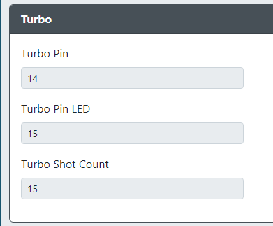
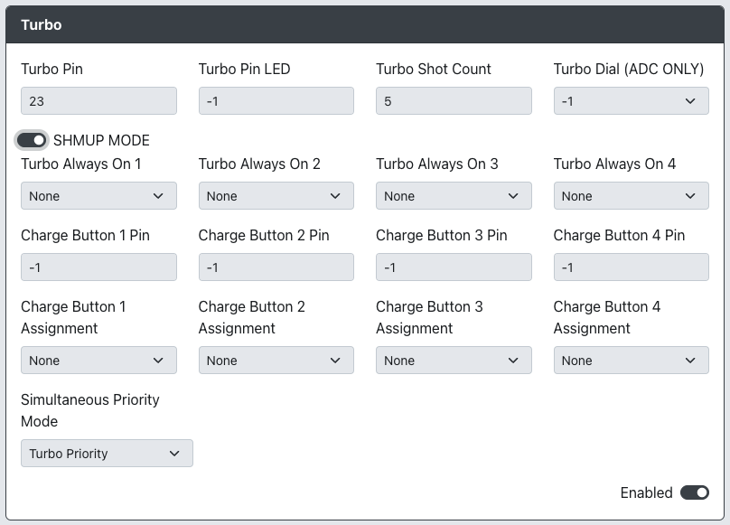

# Turbo

* `Turbo Pin` - The GPIO pin used for the Turbo button.
* `Turbo Pin LED` - The GPIO pin used for the Turbo LED.
* `Turbo Shot Count` - The number of of presses per second that the Turbo will activate at.
* `Turbo Dial (ADC ONLY)` - The GPIO pin used for the Turbo dial.  Must be one of the ADC pins.

## Turbo - SHMUP MODE

* `Turbo Always On 1` - The GPIO pin used for a Turbo button that will always be on.
* `Turbo Always On 2` - The GPIO pin used for a Turbo button that will always be on.
* `Turbo Always On 3` - The GPIO pin used for a Turbo button that will always be on.
* `Turbo Always On 4` - The GPIO pin used for a Turbo button that will always be on.
* `Charge Button 1 Pin` - The GPIO pin used for a button that needs to be able to do a charged shot.
* `Charge Button 2 Pin` - The GPIO pin used for a button that needs to be able to do a charged shot.
* `Charge Button 3 Pin` - The GPIO pin used for a button that needs to be able to do a charged shot.
* `Charge Button 4 Pin` - The GPIO pin used for a button that needs to be able to do a charged shot.
* `Charge Button 1 Assignment` - The button that will be able to charge shot regardless of Turbo status.
* `Charge Button 2 Assignment` - The button that will be able to charge shot regardless of Turbo status.
* `Charge Button 3 Assignment` - The button that will be able to charge shot regardless of Turbo status.
* `Charge Button 4 Assignment` - The button that will be able to charge shot regardless of Turbo status.
* `Simultaneous Priority Mode` - In the event both the Turbo and charged buttons are pressed at the time same, which should take priority.