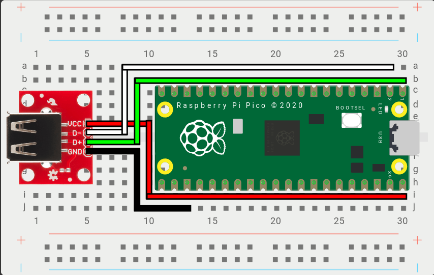

# USB Host Based Add-ons

These add-ons are predicated on having and using a USB Host Port on the device. These settings are shared between the add-ons in this section.

* `D+` - The GPIO Pin used to carry Data Plus between the USB Host Port and RP2040
* `D-` - The GPIO Pin used to carry Data Minus between the USB Host Port and RP2040. This cannot be set and will be automatically determined from `D+`.
* `5V Power (optional)` - The GPIO Pin used to enable 5V power to the host port on the board. This is only applicable to a small number of boards (e.g. Adafruit RP2040 Feather USB Host) and most boards do not require this to be set.

## Example Wiring Diagram

This example wiring diagram is applicable to both the PS Passthrough and the Keyboard Host Configuration Add-ons as both require a USB host port to be set up and connected to the board.

* `VCC` - Connects to 5V power (Example: VBUS on the Raspberry Pi Pico)
* `D+` - Connects to the `D+` GPIO Pin above, set in the Web Configurator. (Example: GPIO0 on the Raspberry Pi Pico)
* `D-` - Connects to the `D-` GPIO Pin above, automatically set based on D+. (Example: GPIO1 on the Raspberry Pi Pico)
* `GND` - Connects to a ground pin, any `GND` pin will work. (Example: GND on the Raspberry Pi Pico)
