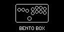

# Community Splash Screens

Here is a collection of community created splash screens that can be used with an optional OLED screen. Upload the image using the web configurator to set it up.

All images been formatted to 128x64 in black / white color.

|  |  |  |  |  |
|---|---|---|---|---|
|  |  |  |  |  |
|  |  |   |   |   |