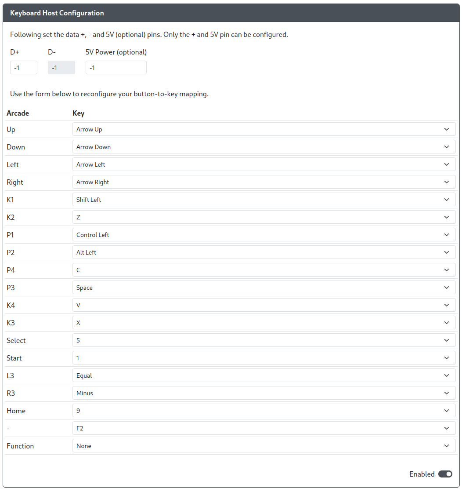

import PinOption from './usb-host-add-on/_pin-options.md'
import ExampleWiringDiagram from './usb-host-add-on/_example-wiring-diagram.md'

# Keyboard Host Configuration

<PinOption />

## Hardware Requirements

 This add-on requires that you have something like the  or a board with a USB passthrough port on it already.  

### Example Wiring Diagram

<ExampleWiringDiagram />