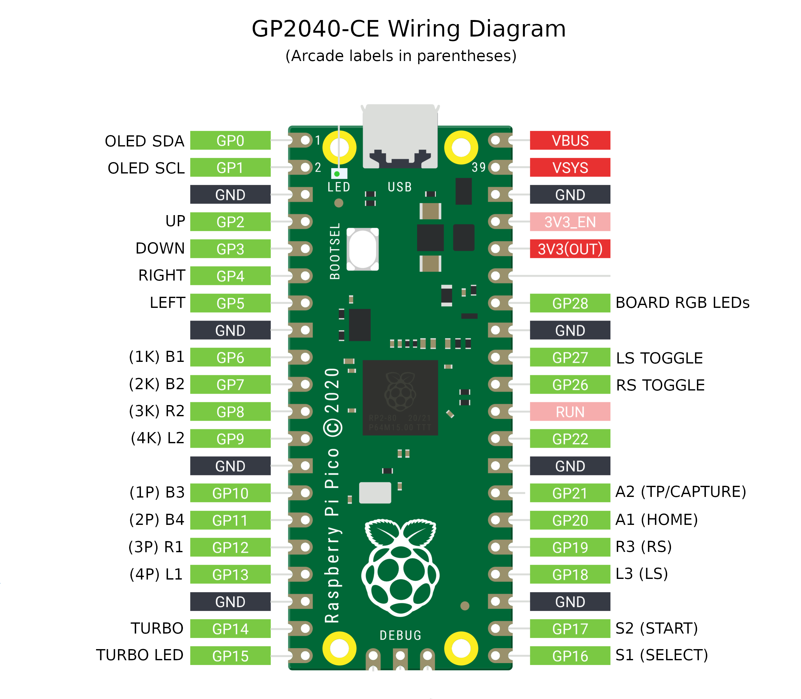
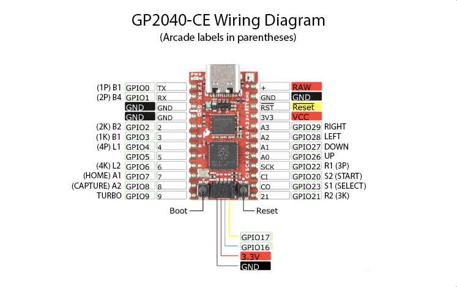
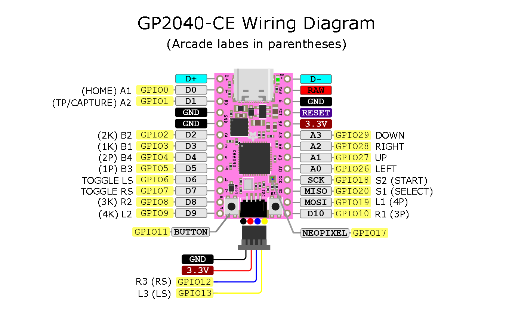

# Wiring

These are the default pin mappings for each GP2040-CE supported microcontroller board.

## Raspberry Pi Pico

:::note

The Raspberry Pi Pico pinout can also be used on clone boards with the same form factor and pinout, such as the Pimironi Pico LiPo and the Waveshare RP2040-Plus.

:::

## SparkFun Pro Micro - RP2040

## Waveshare RP2040-Zero

## Adafruit KB2040

