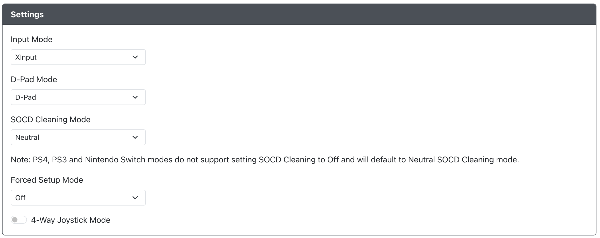
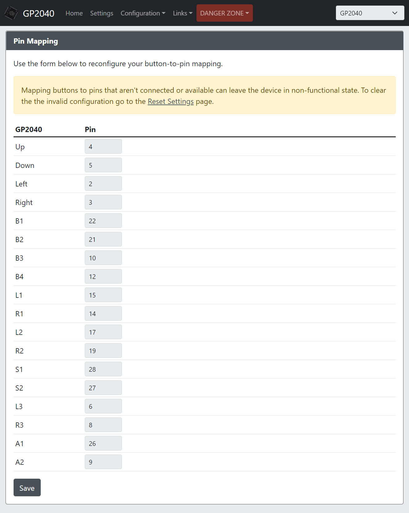
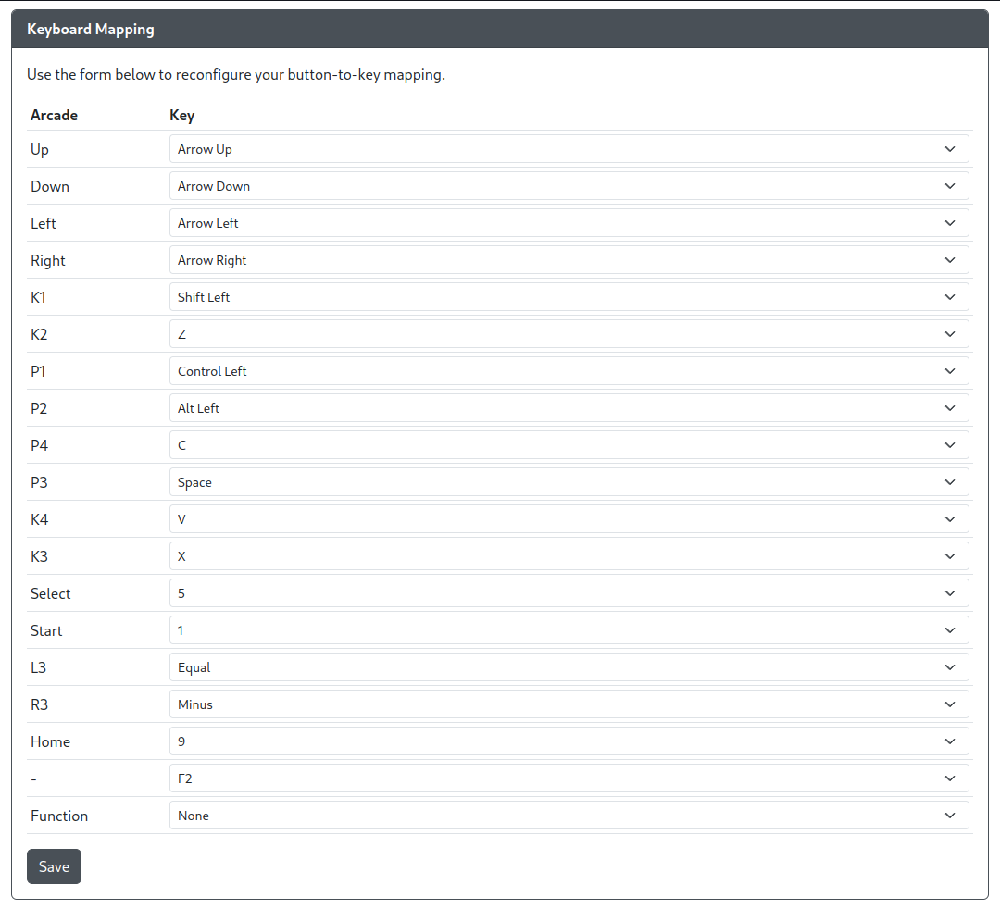
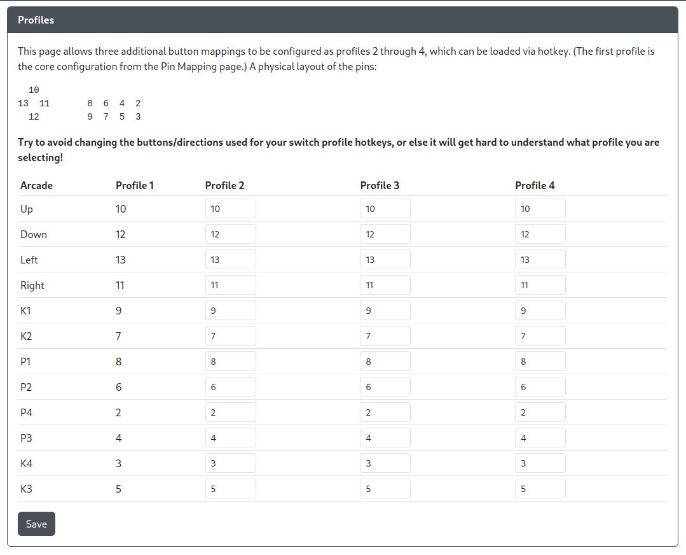
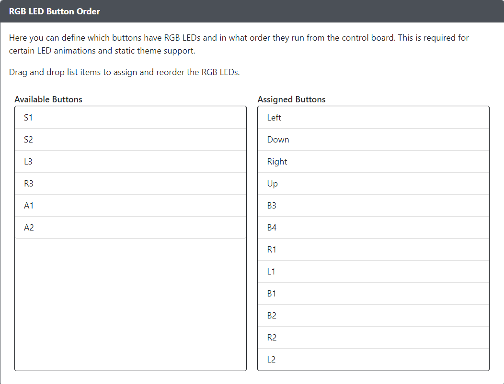
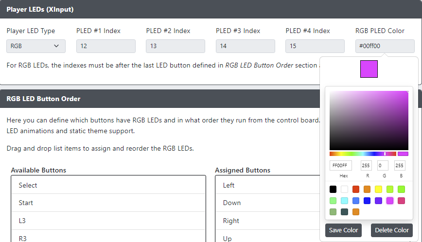
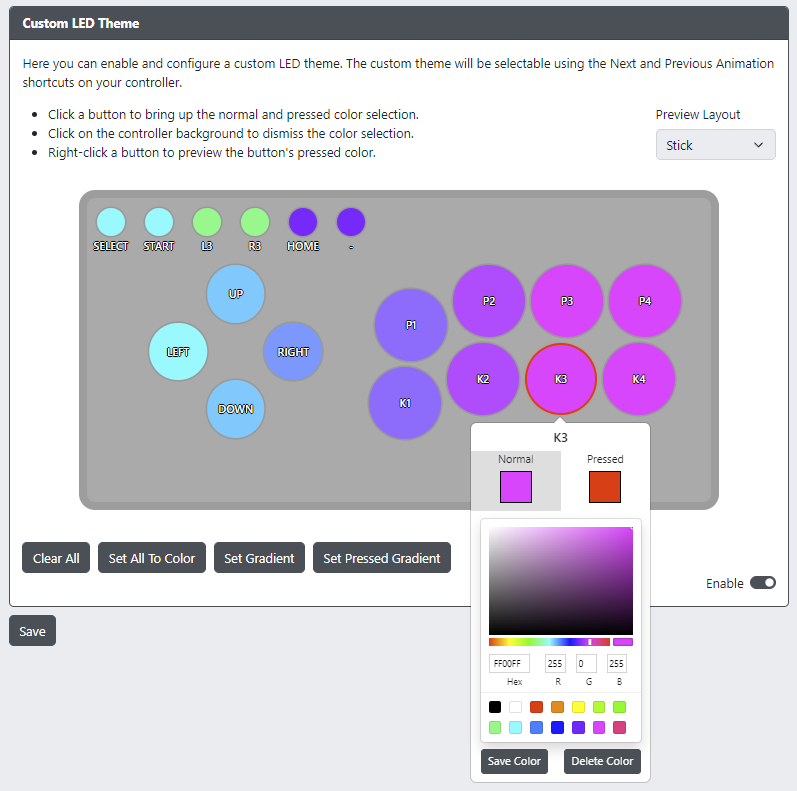
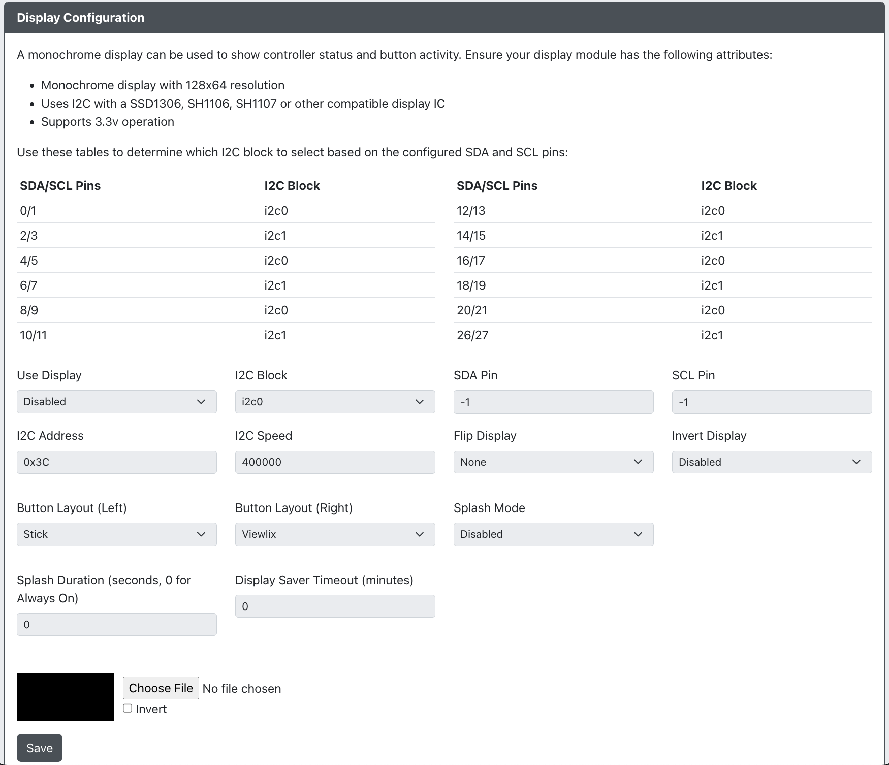
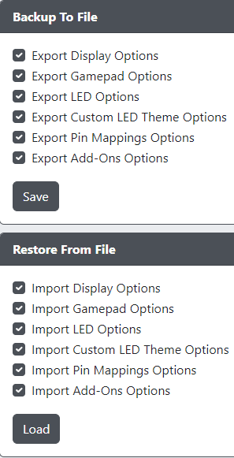
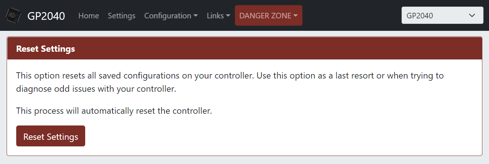

# GP2040-CE Web Configurator

Select the button labels to be displayed in the web configurator guide: <label-selector></label-selector>

GP2040-CE contains a built-in web-based configuration application which can be started up by holding <Hotkey buttons={["S2"]}/> when plugging your controller into a PC. Then access <http://192.168.7.1> in a web browser to begin configuration. This mode is compatible with Windows, Mac, Linux and SteamOS. When using the web-based configuration on Windows and Mac, RNDIS works on a default install. Linux distributions may need some extra steps to access the web configurator; see [Linux Setup](#linux-setup).

## Home


Here you can see the current version of your firmware and the latest version available on GitHub in the releases section. If a firmware update is available, a link to that release will appear.

The options in the main menu are:

- [Home](#home) - The start page.
- [Settings](#settings) - Adjust settings like input mode, d-pad mode, etc.
- [Configuration > Pin Mapping](#pin-mapping) - Allows for remapping of GPIO pins to different buttons.
- [Configuration > Keyboard Mapping](#keyboard-mapping) - Allows for remapping of keyboard keys to different controller inputs.
- [Configuration > Profile Settings](#profile-settings) - Allows for remapping of GPIO pins to different buttons.
- [Configuration > LED Configuration](#led-configuration) - Enable and configure RGB LEDs here.
- [Configuration > Display Configuration](#display-configuration) - Enable and configure display options.
- [Configuration > Add-Ons Configuration](#add-ons-configuration) - Enable and configure available add-ons.
- [Configuration > Data Backup and Restoration](#data-backup-and-restoration) - Backup and restore settings.
- Links - Useful links to the project and documentation
- [DANGER ZONE](#danger-zone) - Don't be afraid of the big red button. If something becomes misconfigured, you can reset your settings here.

## Settings



Here you can select the basic settings which are normally available via hotkeys.

- `Input Mode` - Choose the main input mode (XINPUT, DINPUT, Switch, PS4, HID-Keyboard) this connected device will boot into when powered on. This selection will persist through unplug / replug.
- `D-Pad Mode` - Choose the default D-Pad mode (D-Pad, Left Stick or Right Stick).
- `SOCD Cleaning Mode` - Choose the default SOCD Cleaning Mode (Neutral, Last Win, First Win, OFF). Please note that PS4, PS3 and Nintendo Switch modes do not support setting SOCD to off and will default to Neutral SOCD.
- `Forced Setup Mode` - Allows you to lock out Input Mode, the ability to enter Web-Config or both. Enabling a web-config lockout will require you to nuke and reload the firmware if you wish to make further changes.
- `4-Way Joystick Mode` - Enables 4-Way Joystick mode which will prevent cardinal directions.

Please note that if you choose `PS4` mode you will have an additional option to set the device as a `Controller` or a `Fightstick`. If you choose `Fightstick` and want to use this device with compatible PS5 games you will need to enable the `PS Passthrough` add-on and have a way to connect the device you with to use for passthrough authentication to the RP2040-CE based device via a USB passthrough port.

### Hotkey Settings


An arbitrary number of buttons and directions, plus the optional Function (Fn) button, can be used to define
desired hotkey actions. Select Fn if desired, plus one or more buttons/directions, and associate them with a
hotkey action. The default hotkeys can be modified or removed, and new ones added, up to 12 in total.

The available hotkey actions will expand over time. We may also expand the number of hotkeys available to
configure in the future.

## Pin Mapping



Here you can remap the GP2040-CE buttons to different GPIO pins on the RP2040 chip. This can be used to simply remap buttons, or bypass a GPIO pin that may have issues on your device.

## Keyboard Mapping



Here you can remap the GP2040-CE buttons to different keyboard keycodes that will be sent to the PC or game console when pressed in Keyboard Mode.

## Profile Settings



Here you can set profiles that will change the GPIO to GP2040-CE button mapping based on what profile you have set. You can change the profile number either using the Web Configurator or using a hotkey shortcut.

## LED Configuration

If you have a setup with per-button RGB LEDs, they can be configured here.

### RGB LED Configuration


- `Data Pin` - The GPIO pin that will drive the data line for your RGB LED chain. Set to `-1` to disable RGB LEDs.
- `LED Format` - The data format used to communicate with your RGB LEDs. If unsure the default `GRB` value is usually safe.
- `LED Layout` - Select the layout for your controls/buttons. This is used for static themes and some per-button animations.
- `LEDs Per Button` - Set the number of LEDs in each button on your chain.
- `Max Brightness` - Set the maximum brightness for the LEDs. Ranges from 0-255.
- `Brightness Steps` - The number of levels of brightness to cycle through when turning brightness up and down.

### RGB LED Button Order

:::note

Please note that RGB Button LEDs must be the first LEDs configured. They will start at index 0 on the RGB LED strip.

:::



- `LED Button Order` - Configure which buttons and what order they reside on the LED chain.

### Player LEDs (XInput)

Available selections for `Player LED Type` are `None`, `PWM` or `RGB`.

#### PWM Player LEDs


- `PLED #[1-4] Pin` - The GPIO pin the standard LED is connected to.

#### RGB Player LEDs

:::note

Please note that RGB Player LEDs must be located at an index after the RGB LED Buttons on the LED strip! The Web Config interface will suggest a starting index based on the number of LED buttons mapped in [RGB LED Button Order](#rgb-led-button-order) and the select `LEDs Per Button` value. We hope to remove this limitation in the future.

:::



- `PLED #[1-4] Index` - The index of the LED module on the RGB strip.
- `RGB PLED Color` - Click the box to reveal a color picker, or manually enter the color.

## Custom LED Theme



- `Enable` - Enables the use of Custom LED Theme.
- `Preview Layout` - Predefined layouts for previewing LED theme. **NOTE:** This is for preview only, does not affect controller operation.
- `Clear All` - Prompts for confirmation to reset the current theme to all buttons black (LEDs off). Make sure you have saved and have a backup if you don't want to lose your customizations.
- `Set All To Color` - Presents a color picker to set all buttons to the same normal or pressed color.
- `Set Gradient` - Sets a horizontal gradient across the action buttons according to the `Preview Layout` selection.
- `Set Pressed Gradient` - Same as `Set Gradient`, but for pressed button state.
- `Save Color` - Save a custom color to the color picker palette.
- `Delete Color` - Deletes a custom color from the color picker palette. Stock colors cannot be deleted.

:::note

All saved colors and gradient selections are saved to your browser's local storage.

:::

If enabled, the Custom LED Theme will be available as another animation mode and will cycle with the `Previous Animation` and `Next Animation` shortcuts on your controller. You can also use the [Data Backup and Restoration](#data-backup-and-restoration) feature to create and share themes!

## Display Configuration



- `Use Display` - Turns on/off the display module.
- `I2C Block` - The Pico I2C block that will be used. Set based on pins, refer to table on page.
- `SDA Pin` - The GPIO pin used for the I2C SDA channel.
- `SCL Pin` - The GPIO pin used for the I2C SCL channel.
- `I2C Address` - The I2C address of your device, defaults to the very commonly used `0x3C`.
- `I2C Speed` - Sets the speed of I2C communication. Common values are `100000` for standard, `400000` for fast and `800000` ludicrous speed.
- `Flip Display` - Allows you to flip or mirror the display in a variety of ways.
- `Invert Display` - Inverts the pixel colors, effectively giving you a negative image when enabled.
- `Button Layout (Left)` - Changes the onscreen layout for the left side of the display and stick.
- `Button Layout (Right)` - Changes the onscreen layout for the right side of the display and stick.
- `Splash Mode` - Enables or disables a splash screen displaying when the unit is turned on.
- `Splash Duration` - Sets the amount of time the splash screen displays for on boot.
- `Display Saver Timeout` - Will cause the display to turn off after the specified number of minutes. Pressing any input will cause the display to turn back on.
- `Choose File` - This will allow you to upload your own image to be used for the splash screen. It is recommend that you use a two color 128x64 image (or one that is sized appropriately for your display). Uploading any other type of image will result in a conversion and sizing of the image automatically. If the image is inverted upon upload, just check off the `Invert` box.

Check out our collection of great custom splash screens from the community [HERE](./community-splash-screens.md)

## Add-Ons Configuration

This section is for custom add-ons that can be enabled to expand the functionality of GP2040-CE. Due to the large number of add-ons created by the community, they are located in a separate documentation page. Navigate to Web Configurator - Add-ons for more information.

## Data Backup and Restoration



- `Backup To File` - Allows you to select what to backup to a file (default is all selected).
- `Restore From File` - Allows you to select what to restore from a file (default is all selected).

## DANGER ZONE



## Linux Setup

When you plug in your controller while holding <Hotkey buttons={["S2"]}/>, you should see it connect in the kernel logs if you run `dmesg`:

```sh
[   72.291060] usb 1-3: new full-speed USB device number 12 using xhci_hcd
[   72.450166] usb 1-3: New USB device found, idVendor=cafe, idProduct=4028, bcdDevice= 1.01
[   72.450172] usb 1-3: New USB device strings: Mfr=1, Product=2, SerialNumber=3
[   72.450174] usb 1-3: Product: TinyUSB Device
[   72.450176] usb 1-3: Manufacturer: TinyUSB
[   72.450177] usb 1-3: SerialNumber: 123456
[   72.484285] rndis_host 1-3:1.0 usb0: register 'rndis_host' at usb-0000:06:00.1-3, RNDIS device, 02:02:84:6a:96:00
[   72.498630] rndis_host 1-3:1.0 enp6s0f1u3: renamed from usb0
```

In the above example, **enp6s0f1u3** is the virtual Ethernet interface for your controller. If you don't see the first `rndis_host` line, make sure `CONFIG_USB_NET_RNDIS_HOST` is compiled in your kernel or as a module.

The web configurator is automatically running, you just need to be able to reach it. Some configurations automatically set up the route, so try <http://192.168.7.1> in your browser now. If it doesn't load, try configuring an IP for the interface manually via: `sudo ifconfig enp6s0f1u3 192.168.7.2`.

Whether or not you had to add an IP manually, you should end up with a route something like this:

```sh
% ip route
default via 10.0.5.1 dev enp5s0 proto dhcp src 10.0.5.38 metric 2
10.0.5.0/24 dev enp5s0 proto dhcp scope link src 10.0.5.38 metric 2
192.168.7.0/24 dev enp6s0f1u3 proto kernel scope link src 192.168.7.2     <---
```

Then the configurator should be reachable in your browser.
