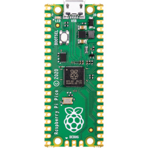
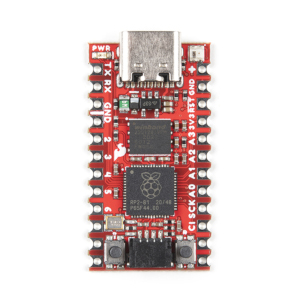
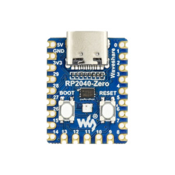
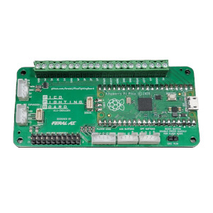
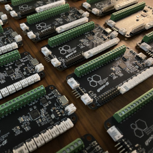
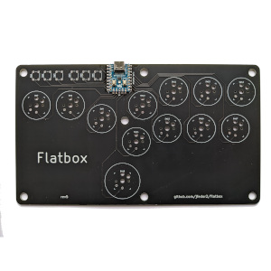
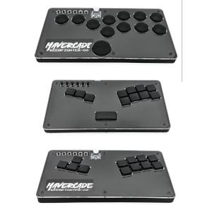
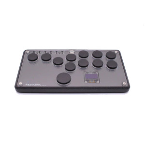
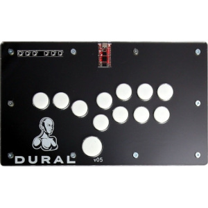
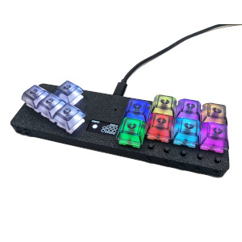

# Download GP2040-CE

## Microcontroller Boards

  <a href="https://github.com/OpenStickCommunity/GP2040-CE/releases/download/v0.7.0/GP2040-CE_0.7.0_Pico.uf2">
    

      
      Raspberry Pi Pico
    

  </a>
  <a href="https://github.com/OpenStickCommunity/GP2040-CE/releases/download/v0.7.0/GP2040-CE_0.7.0_SparkFunProMicro.uf2">
    

      
      SparkFun Pro Micro - RP2040
    

  </a>
  <a href="https://github.com/OpenStickCommunity/GP2040-CE/releases/download/v0.7.0/GP2040-CE_0.7.0_WaveshareZero.uf2">
    

      
      Waveshare RP2040-Zero
    

  </a>

## Breakout Boards

  <a href="https://github.com/OpenStickCommunity/GP2040-CE/releases/download/v0.7.0/GP2040-CE_0.7.0_PicoFightingBoard.uf2">
    

      
      Pico Fighting Board
    

  </a>
  <a href="https://github.com/OpenStickCommunity/GP2040-CE/releases/download/v0.7.0/GP2040-CE_0.7.0_Pico.uf2">
    

      
      RP2040 Advanced Breakout
    

  </a>

## Open Source Controllers

  <a href="https://github.com/OpenStickCommunity/GP2040-CE/releases/download/v0.7.0/GP2040-CE_0.7.0_FlatboxRev4.uf2">
    

      
      Flatbox Rev 4
    

  </a>
  <a href="https://github.com/OpenStickCommunity/GP2040-CE/releases/download/v0.7.0/GP2040-CE_0.7.0_FlatboxRev5.uf2">
    

      
      Flatbox Rev 5
    

  </a>

## Retail Controllers

  <a href="https://github.com/OpenStickCommunity/GP2040-CE/releases/download/v0.7.0/GP2040-CE_0.7.0_MavercadeKeebfighter.uf2">
    

      
      Mavercade Keebfighter
    

  </a>
  <a href="https://github.com/OpenStickCommunity/GP2040-CE/releases/download/v0.7.0/GP2040-CE_0.7.0_BentoBox.uf2">
    

      
      ScrubTier BentoBox
    

  </a>

## Legacy Controllers

The builds for these devices are no longer supported in GP2040-CE. They remain available as a convenience to the community.

  <a href="https://github.com/OpenStickCommunity/GP2040-CE/releases/download/v0.7.0/GP2040-CE_0.7.0_DURAL.uf2">
    

      
      DURAL
    

  </a>
  <a href="https://github.com/OpenStickCommunity/GP2040-CE/releases/download/v0.7.0/GP2040-CE_0.7.0_FightboardV3.uf2">
    

      
      Fightboard V3
    

  </a>
  <a href="https://github.com/OpenStickCommunity/GP2040-CE/releases/download/v0.7.0/GP2040-CE_0.7.0_FightboardV3Mirrored.uf2">
    

      
      Fightboard V3 Mirrored
    

  </a>
  <a href="https://github.com/OpenStickCommunity/GP2040-CE/releases/download/v0.7.0/GP2040-CE_0.7.0_PicoAnn.uf2">
    

      
      PicoAnn
    

  </a>

