# RGB LEDs

## Hardware Requirements

GP2040-CE requires that addressable RGB LEDs be used for nearly all LED functions.

The exception to this are [Player LEDs](add-ons/player-number.md), which can use pulse width modulation (PWM) to vary the brightness of the LEDs.

## RGB LED Hotkeys

| Hotkey | Description |
| - | - |
| <hotkey v-bind:buttons='["S1", "S2", "B3"]'></hotkey> | Next Animation |
| <hotkey v-bind:buttons='["S1", "S2", "B1"]'></hotkey> | Previous Animation |
| <hotkey v-bind:buttons='["S1", "S2", "B4"]'></hotkey> | Brightness Up |
| <hotkey v-bind:buttons='["S1", "S2", "B2"]'></hotkey> | Brightness Down |
| <hotkey v-bind:buttons='["S1", "S2", "R1"]'></hotkey> | LED Parameter Up |
| <hotkey v-bind:buttons='["S1", "S2", "R2"]'></hotkey> | LED Parameter Down |
| <hotkey v-bind:buttons='["S1", "S2", "L1"]'></hotkey> | Pressed Parameter Up |
| <hotkey v-bind:buttons='["S1", "S2", "L2"]'></hotkey> | Pressed Parameter Down |

?> The `LED Parameter` hotkeys may affect color, speed or theme depending on the current RGB LED animation. The `Pressed Parameter` options will change the colors/effects for the on-press animations.

## RGB LED Animations

The following animations are available:

| Name | Description | LED Parameter |
| - | - | - |
| Off | Turn off per-button RGB LEDs | - |
| Static Color | Sets all LEDs to the same color | Cycle through colors: *Red*, *Orange*, *Yellow*, *Lime Green*, *Green*, *Seafoam*, *Aqua*, *Sky Blue*, *Blue*, *Purple*, *Pink*, *Magenta* |
| Rainbow Cycle | All LEDs cycle through the color wheel displaying the same color | Adjust animation speed |
| Rainbow Chase | A fading, rainbow cycling lines travels across the LED chain | Adjust animation speed |
| Static Theme | Set the LEDs to a pre-defined static theme | Cycle through themes, see [RGB LED Static Themes](#rgb-led-static-themes) for details. |

## RGB LED Static Themes

| Name | Preview |
| - | - |
| **Static Rainbow** | 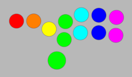 |
| **Xbox** | 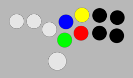 |
| **Xbox (All)** | 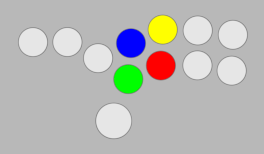 |
| **Super Famicom** | 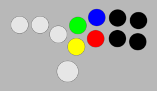 |
| **Super Famicom (All)** |  |
| **PlayStation** | 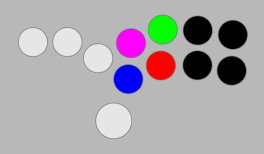 |
| **PlayStation (All)** | 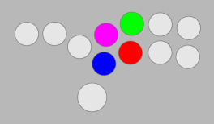 |
| **Neo Geo Straight** | 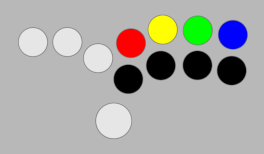 |
| **Neo Geo Curved** | 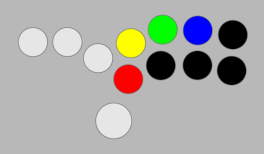 |
| **Neo Geo Modern** | 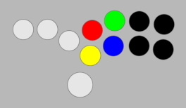 |
| **Six Button Fighter** | 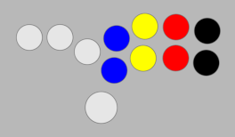 |
| **Six Button Fighter +** | 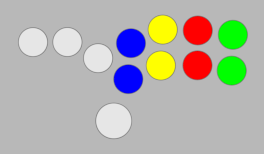 |
| **Street Fighter 2** | 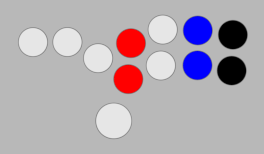 |
| **Tekken** | 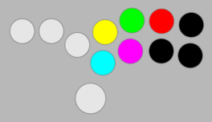 |
| **Guilty Gear Type-A** | 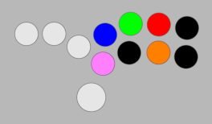 |
| **Guilty Gear Type-B** | 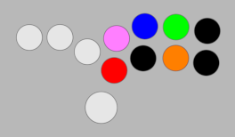 |
| **Guilty Gear Type-C** |  |
| **Guilty Gear Type-D** | 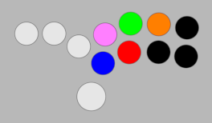 |
| **Guilty Gear Type-E** | 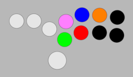 |
| **Fightboard** | 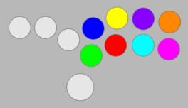 |
