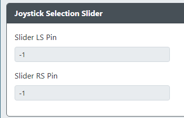
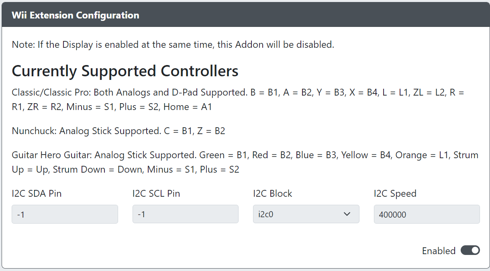

# Add-Ons Configuration

This section is for custom add-ons that can be enabled to expand the functionality of GP2040-CE.  Please note that not all add-ons may work together.  These should be considered experimental.

## BOOTSEL Button Configuration

* `BOOTSEL Button` - Choose an input to be mapped to the BOOTSEL button.

Please note that this can only be used on devices that have a BOOTSEL button.  Please also note that the OLED might become unresponsive if this button is set. You can unset it to restore OLED functionality.

## On-board LED Configuration

* `Off` - LED is off
* `Mode Indicator` - LED is solid if unit is powered with connected data, LED blinks rapidly if powered with no data, LED blinks slowly when in web-config mode.
* `Input Test` - LED is off but turns on when any input is pressed (LED turns off when button is released).

## Analog

* `Analog Stick 1 X Pin` - The GPIO pin used for the Analog Stick 1 X value.  Only ADC pins 26, 27, 28 and 29 are allowed here.
* `Analog Stick 1 Y Pin` - The GPIO pin used for the Analog Stick 1 Y value.  Only ADC pins 26, 27, 28 and 29 are allowed here.
* `Analog Stick 1 Mode` - Choose if Analog Stick 1 is to be used for Left Analog or Right Analog.  
* `Analog Stick 1 Invert` - Choose if you would like to flip the X or Y axis Analog Stick 1 inputs (or both).
* `Analog Stick 2 X Pin` - The GPIO pin used for the Analog Stick 2 X value.  Only ADC pins 26, 27, 28 and 29 are allowed here.
* `Analog Stick 2 Y Pin` - The GPIO pin used for the Analog Stick 2 Y value.  Only ADC pins 26, 27, 28 and 29 are allowed here.
* `Analog Stick 2 Mode` - Choose if Analog Stick 2 is to be used for Left Analog or Right Analog (must be different than Analog Stick 1).
* `Analog Stick 2 Invert` - Choose if you would like to flip the X or Y axis Analog Stick 2 inputs (or both).
* `Deadzone Size (%)` - Enter the % value of deadzone you would like on the analog sticks.
* `Forced Circularity` - Force the analog sticks to be bound within a perfect circle. This can be beneficial for certain games. However, be aware that this may negatively impact some games which account for sticks moving outside of a circle.
* `Auto Calibration` - Automatically centers the analog sticks. This works by reading in the offset from center during boot and then accounts for that until the next power cycle. This can be helpful for analog sticks experiencing drift.

## Turbo

* `Turbo Pin` - The GPIO pin used for the Turbo button.
* `Turbo Pin LED` - The GPIO pin used for the Turbo LED.
* `Turbo Shot Count` - The number of of presses per second that the Turbo will activate at.
* `Turbo Dial (ADC ONLY)` - The GPIO pin used for the Turbo dial.  Must be one of the ADC pins.

## Turbo - SHMUP MODE

* `Turbo Always On 1` - The GPIO pin used for a Turbo button that will always be on.
* `Turbo Always On 2` - The GPIO pin used for a Turbo button that will always be on.
* `Turbo Always On 3` - The GPIO pin used for a Turbo button that will always be on.
* `Turbo Always On 4` - The GPIO pin used for a Turbo button that will always be on.
* `Charge Button 1 Pin` - The GPIO pin used for a button that needs to be able to do a charged shot.
* `Charge Button 2 Pin` - The GPIO pin used for a button that needs to be able to do a charged shot.
* `Charge Button 3 Pin` - The GPIO pin used for a button that needs to be able to do a charged shot.
* `Charge Button 4 Pin` - The GPIO pin used for a button that needs to be able to do a charged shot.
* `Charge Button 1 Assignment` - The button that will be able to charge shot regardless of Turbo status.
* `Charge Button 2 Assignment` - The button that will be able to charge shot regardless of Turbo status.
* `Charge Button 3 Assignment` - The button that will be able to charge shot regardless of Turbo status.
* `Charge Button 4 Assignment` - The button that will be able to charge shot regardless of Turbo status.
* `Simultaneous Priority Mode` - In the event both the Turbo and charged buttons are pressed at the time same, which should take priority.

## Joystick Selection Slider

* `Slider LS Pin` - The GPIO pin used to activate the Left Stick while held.
* `Slider RS Pin` - The GPIO pin used to activate the Right Stick while held.

## Input Reverse

* `Reverse Input Pin` - The GPIO pin used for the Reverse Input button.
* `Reverse Input Pin LED` - The GPIO pin used for the Reverse Input LED.
* `Reverse Up` - Enables the up direction to be reversed when the Reverse Input button is pressed or held.
* `Reverse Down` - Enables the down direction to be reversed when the Reverse Input button is pressed or held.
* `Reverse Left` - Enables the left direction to be reversed when the Reverse Input button is pressed or held.
* `Reverse Right` - Enables the right direction to be reversed when the Reverse Input button is pressed or held.

## I2C Analog ADS1219

* `I2C Analog ADS1219 SDA Pin` - The GPIO pin used for I2C Analog ADS1219 SDA.
* `I2C Analog ADS1219 SCL Pin` - The GPIO pin used for I2C Analog ADS1219 SCL.
* `I2C Analog ADS1219 Block` - The block of I2C to use (i2c0 or i2c1).
* `I2C Analog ADS1219 Speed` - Sets the speed of I2C communication. Common values are `100000` for standard, `400000` for fast and `800000` ludicrous speed.
* `I2C Analog ADS1219 Address` - Sets the address for the I2C Analog ADS1219.

## Dual Directional Input

* `Dual Up Pin` - The GPIO pin used for the secondary Up direction.
* `Dual Down Pin` - The GPIO pin used for the secondary Down direction.
* `Dual Left Pin` - The GPIO pin used for the secondary Left direction.
* `Dual Right Pin` - The GPIO pin used for the secondary Right direction.
* `Dual D-Pad Mode` - Choose if this should act as an additional instance of the D-Pad or as the Left or Right stick.
Values are:
`D-PAD` for D-PAd mode.
`Left Analog` for Left Analog stick mode.
`Right Analog` for Right Analog stick mode.
* `Combination Mode` - Choose how these inputs should be combined.
Values are:
`Mixed` - Combines both the Gamepad input and Dual Directional and allows for all 3 SOCD modes.
`Gamepad` - Gamepad always takes over when pressed, otherwise Gamepad and Dual act independently.
`Dual Directional` - Dual always takes over when pressed, otherwise Gamepad and Dual act independently.
`None` - Gamepad input and dual directional act independently of each other.

## Buzzer Speaker

* `Use buzzer` - Turns on/off the buzzer module.
* `Buzzer Pin` - The GPIO pin used for the buzzer.
* `Buzzer Volume` - Audio volume of buzzer. Ranges from 0-100.

## Extra Button Configuration

* `Extra Button Pin` - The GPIO pin used for the extra instance of a button.
* `Extra Button` - The button that will have an extra instance.

## Player Number (X-INPUT ONLY)

* `Player Number` - Choose what player number this RP2040 based device will be representing.  This is only for X-INPUT mode.

## SOCD Selection Slider

* `SOCD Slider Mode Default` - The default SOCD mode to be used when the slider pin is not activated.
* `SOCD Slider Mode Tne` - The SOCD mode you would like to have enabled for the first slder position.
* `Pin One` - The GPIO pin used for first SOCD mode slider position.
* `SOCD Slider Mode Two` - The SOCD mode you would like to have enabled for the second slder position.
* `Pin Two` - The GPIO pin used for second SOCD mode slider position.

## PS4 Mode

Please note that GP2040-CE will never provide these files!

Enabling this add-on will allow you to use GP2040-CE on a PS4 with an 8 minute timeout.  If you have the necessary files to upload in this section it will authenticate to a native PS4 device and not time out after 8 minutes.

* `Private Key (PEM)` - Choose your PEM file.
* `Serial Number (16 Bytes in Hex Ascii)` - Choose your serial number file.
* `Signature (256 Bytes in Binary)` - Choose your signature file.

## Wii Extensions

* `I2C SDA Pin` - The GPIO pin used for Wii Extension SDA.
* `I2C SCL Pin` - The GPIO pin used for Wii Extension SCL.
* `I2C Block` - The block of I2C to use (i2c0 or i2c1).
* `I2C Speed` - Sets the speed of I2C communication. Common values are `100000` for standard, or `400000` for fast.

Supported Extension Controllers and their mapping is as follows:

| GP2040-CE | Nunchuck | Classic      | Guitar Hero Guitar |
|-----------|----------|--------------|--------------------|
| B1        | C        | B            | Green              |
| B2        | Z        | A            | Red                |
| B3        |          | Y            | Blue               |
| B4        |          | X            | Yellow             |
| L1        |          | L            |                    |
| L2        |          | ZL           |                    |
| R1        |          | R            |                    |
| R2        |          | ZR           |                    |
| S1        |          | Select       |                    |
| S2        |          | Start        |                    |
| A1        |          | Home         |                    |
| D-Pad     |          | D-Pad        | Strum Up/Down      |
| Analog    | Left     | Left & Right | Left               |

Classic Controller support includes Classic, Classic Pro, and NES/SNES Mini Controllers. 

Original Classic Controller L & R triggers are analog sensitive, where Pro triggers are not.

## SNES Input

* `CLOCK Pin` - The GPIO pin used for SNES CLOCK.
* `LATCH Pin` - The GPIO pin used for SNES LATCH.
* `DATA Pin` - The GPIO pin used for SNES DATA.

Supported controller types and their mapping is as follows:

| GP2040-CE | NES      | SNES         | Super NES Mouse    |
|-----------|----------|--------------|--------------------|
| B1        | B        | B            | Left Click         |
| B2        | A        | A            | Right Click        |
| B3        |          | Y            |                    |
| B4        |          | X            |                    |
| L1        |          | L            |                    |
| L2        |          |              |                    |
| R1        |          | R            |                    |
| R2        |          |              |                    |
| S1        | Select   | Select       |                    |
| S2        | Start    | Start        |                    |
| A1        |          |              |                    |
| D-Pad     | D-Pad    | D-Pad        |                    |
| Analog    |          |              | Mouse Movement     |

## Focus Mode Configuration

* `Focus Mode Pin` - The GPIO pin used to enable Focus Mode (this needs to always be held so a slider or latching switch is recommended).
* `Lock OLED Screen` - When enabled the OLED screen will not display anything during Focus Mode.
* `Lock RGB LED` - When enabled the RGB LEDs that are controlled by the RP2040 device will not display anything during Focus Mode.
* `Lock Buttons` - When enabled the You can specify specific buttons to not function during Focus Mode.  You can add as many additional buttons as needed here.

## USB Host Based Add-ons

These addons are predicated on having and using a USB Host Port on the device. These settings are shared between the addons in this section.

* `D+` - The GPIO Pin used to carry Data Plus between the USB Host Port and RP2040
* `D-` - The GPIO Pin used to carry Data Minus between the USB Host Port and RP2040. This cannot be set and will be automatically determined from `D+`.
* `5V Power (optional)` - The GPIO Pin used to enable 5V power to the host port on the board. This is only applicable to a small number of boards (e.g. Adafruit RP2040 Feather USB Host) and most boards do not require this to be set.

### PS Passthrough

Enabling this add-on will allow you to use a licenced 3rd party device to authenticate off of.  This addon requires that you have something like the  or a board with a USB passthrough port on it already.  If you have passthrough enabled you can turn off the above `PS4 Mode` addon as the two will not work together.  Please also ensure that under the `Settings` section you have chosen PS4 mode and picked if you want the GP2040-CE unit to function as a controller or as a fightstick.   

### Keyboard Host Configuration

### Example Wiring Diagram

This example wiring diagram is applicable to both the PS Passthrough and the Keyboard Host Configuration Add-ons as both require a USB host port to be set up and connected to the board.

* `VCC` - Connects to 5V power (Example: VBUS on the Raspberry Pi Pico)
* `D+` - Connects to the `D+` GPIO Pin above, set in the Web Configurator. (Example: GPIO0 on the Raspberry Pi Pico)
* `D-` - Connects to the `D-` GPIO Pin above, automatically set based on D+. (Example: GPIO1 on the Raspberry Pi Pico)
* `GND` - Connects to a ground pin, any `GND` pin will work. (Example: GND on the Raspberry Pi Pico)