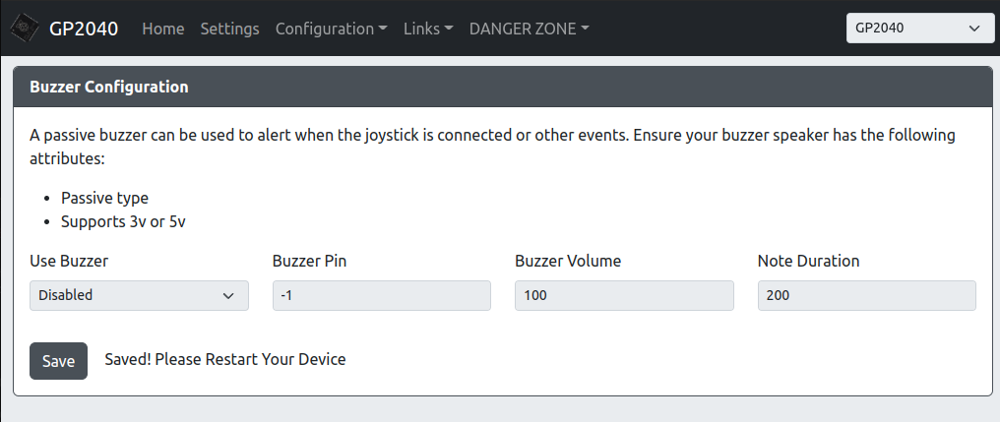

# GP2040 Web Configurator

Select the button labels to be displayed in the web configurator guide: <label-selector></label-selector>

GP2040 contains a built-in web-based configuration application which can be started up by holding <hotkey v-bind:buttons='["S2"]'></hotkey> when plugging your controller into a PC. Then access <http://192.168.7.1> to begin configuration.

## Home

Here you can see the current version of your firmware and the latest version available on Github in the releases section. If a firmware update is available, a link to that release will appear.

The options in the main menu are:

* [Home](#home) - The start page
* [Settings](#settings) - Adjust settings like input mode, d-pad mode, etc.
* [Configuration > Pin Mapping](#pin-mapping) - Allows for remapping of GPIO pins to different buttons.
* [Configuration > LED Configuration](#led-configuration) - Enable and configure RGB LEDs here.
* Links - Useful links to the project and documentation
* [DANGER ZONE](#danger-zone) - Don't be afraid of the big red button. If something becomes misconfigured, you can reset your settings here.

## Settings

Here you can select the basic settings which are normally available via hotkeys.

## Pin Mapping

Here you can remap the GP2040 buttons to different GPIO pins on the RP2040 chip. This can be used to simply remap buttons, or bypass a GPIO pin that may have issues on your device.

## LED Configuration

If you have a setup with per-button RGB LEDs, they can be configured here.

* `Data Pin` - The GPIO pin that will drive the data line for your RGB LED chain. Set to `-1` to disable RGB LEDs.
* `LED Format` - The data format used to communicate with your RGB LEDs. If unsure the default `GRB` value is usually safe.
* `LED Layout` - Select the layout for your controls/buttons. This is used for static themes and some per-button animations.
* `LEDs Per Button` - Set the number of LEDs in each button on your chain.
* `Max Brightness` - Set the maximum brightness for the LEDs. Ranges from 0-255.
* `Brightness Steps` - The number of levels of brightness to cycle through when turning brightness up and down.
* `LED Button Order` - Configure which buttons and what order they reside on the LED chain.

## Display Configuration

* `Use Display` - Turns on/off the display module.
* `I2C Block` - The Pico I2C block that will be used. Set based on pins, refer to table on page.
* `SDA Pin` - The GPIO pin used for the I2C SDA channel.
* `SCL Pin` - The GPIO pin used for the I2C SCL channel.
* `I2C Address` - The I2C address of your device, defaults to the very commonly used `0x3C`
* `I2C Speed` - Sets the speed of I2C communication. Common values are `100000` for standard, `400000` for fast and `800000` ludicrous speed.
* `Flip Display` - Rotates the display 180°.
* `Invert Display` - Inverts the pixel colors, effectively giving you a negative image when enabled.

## Buzzer Speaker Configuration

* `Use buzzer` - Turns on/off the buzzer module.
* `Buzzer Pin` - The GPIO pin used for the buzzer.
* `Buzzer Volume` - Audio volume of buzzer. 0-100.

## DANGER ZONE

