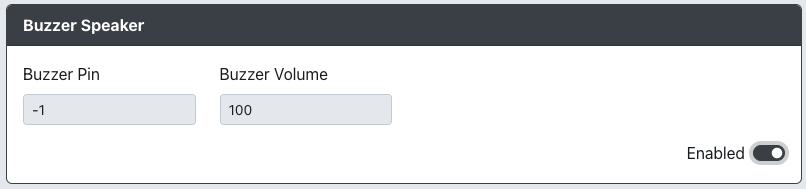

# Buzzer Speaker

Purpose: This add-on is intended to allow you to add a buzzer to your GP2040-CE device and play sounds.

## Web Configurator Options

- `Use buzzer` - Turns on/off the buzzer module.
- `Buzzer Pin` - The GPIO pin used for the buzzer.
- `Buzzer Volume` - Audio volume of buzzer. Ranges from 0-100.

## Hardware

### Requirements

- 3-3.3V Piezo speaker

The speaker only needs to have pins for power (VCC) and ground (GND). If there is an I/O pin on speaker, you can jump the pins and use only the VCC connected to RP2040 GPIO pin.

### Installation

- Plug into GPIO pin on board to VCC on speaker
- Enter GPIO pin into web config

## Miscellaneous Notes

None
