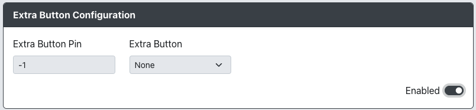

import InputTable from "../snippets/_input-table.mdx";

# Extra Button Configuration

Purpose: This add-on is intended to allow an additional GPIO pin to be assigned to a gamepad input, granting an independently remappable button.

## Web Configurator Options

- `Extra Button Pin` - The GPIO pin used for the extra instance of a button.
- `Extra Button` - The button that will have an extra instance.

## Hardware

### Requirements

This add-on requires an additional button to be mapped to a GPIO pin.

### Installation

For both arcade buttons and keyboard switches, one side of the contacts needs to be connected to the GPIO pin (i.e. by wire or trace on a PCB) and the other connected to ground (i.e. by wire or trace on a PCB).

## Miscellaneous Notes

The Extra Button add-on is limited to the following gamepad inputs.

<InputTable />
